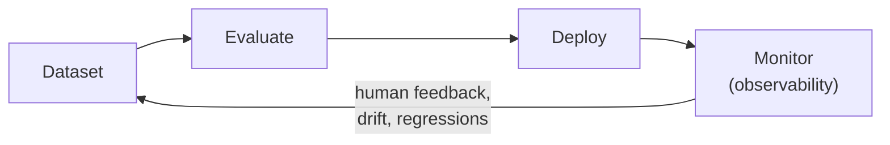

# Agent Evaluation and Observability — Video Notes

Condensed, transcript-based notes from a TMLC Academy session on why agent evaluation is fundamentally different from traditional ML evaluation, the evolution of text-comparison metrics up through LLM-as-judge, and a code walkthrough of TrueLens, DeepEval, and MLflow. See *Agent Evaluation and Observability - Transcript.md* in this folder for the full source recording transcript, and `AI Agents/notebooks/` for related code. No companion slide deck for this session.

**The core idea, in one picture:**

**The analogy that runs through this whole document 🧑‍⚖️**

Grading a traditional ML model is like checking multiple-choice answers — there's exactly one correct bubble, and a machine can score it instantly. Grading an LLM's answer is like grading an essay — two students can write completely different sentences and both deserve full marks, because what matters is whether the *meaning* is right, not whether the wording matches some reference text word for word. This session traces exactly that shift: from mechanical answer-checking (BLEU, ROUGE), to a smarter grader that at least understands *meaning* (BERTScore), to finally hiring a **second, independent examiner** — another LLM — whose whole job is reading the essay and judging it the way a human teacher would (LLM-as-judge). And once the "test-taker" is an *agent*, not just a single essay-writer, you're no longer just grading the final answer — you're grading its entire working, step by step, which is where observability comes in.

---

## 1. Why Evaluation Matters — The Feedback Loop

**The pipeline, unchanged in spirit since traditional ML:** dataset → evaluate → deploy → monitor → (based on what monitoring reveals) → retrain/improve → loop. Evaluation is what happens *before* deployment; monitoring (observability) is what happens *after* — and the two are really one continuous feedback loop, not separate concerns.

**Without evaluation, you're guessing.** You might personally test a handful of queries and conclude a change "improved" the system — but a domain expert testing the same system, from the angle of someone who actually knows where the domain gets tricky, will often find failures a casual test never surfaced. **What evaluation actually buys you:**
- **Measuring improvement** — did the last change (model swap, new prompt, different chunking strategy) actually help, or just feel like it did?
- **Detecting regressions** — a model upgrade can quietly make answers shorter, reasoning worse, or tool selection less reliable; only a standing evaluation pipeline catches this *before* it reaches production, the same way regression testing does in software engineering.
- **Ensuring reliability** — establishing a real, measured confidence threshold for what the system can and can't be trusted to do, rather than an assumption.

---

## 2. Why LLM Evaluation Is Harder Than Traditional ML Evaluation

| | Traditional ML (classification/regression) | LLMs |
|---|---|---|
| **Inference** | Deterministic — same input always gives the same output | Probabilistic — the next token is *sampled* from a distribution, not fixed |
| **Output format** | Structured (a category, a float) | Unstructured — one sentence or several paragraphs, varying every run |
| **Ground truth** | A single clear label to compare against | Many differently-worded answers can all be equally correct |
| **Comparison** | Straightforward (predicted label vs. true label) | Semantic correctness matters more than exact text overlap |

**Why LLMs behave this way:** they're *generative* — probabilistic (sampling the next token from a distribution) *and* non-deterministic (the same meaning can be phrased many valid ways). Ask "what is the capital of France?" twice and you might get *"Paris is the capital of France"* or *"The capital city of France is Paris"* — both entirely correct, worded differently. Traditional evaluation metrics, built for a world with one right answer, simply weren't designed for this.

---

## 3. The Evolution of Text-Comparison Metrics

Each of these compares **generated text vs. a reference (ground truth) text** — and each one is a response to the previous method's weaknesses.

| Metric | What it measures | Strength | Weakness |
|---|---|---|---|
| **BLEU** | N-gram overlap (originally for machine translation) | Good for exact-phrase precision | Penalizes any valid rewording heavily — *"the cat is sitting on the mat"* scores far lower than *"the cat sat on the mat"* despite identical meaning |
| **ROUGE** | Recall-based overlap (originally for summarization); has ROUGE-1 (unigram), ROUGE-2 (bigram), ROUGE-L (longest common subsequence) | Good for checking overall content coverage | Same lexical-overlap weakness as BLEU — different wording of the same meaning can still score inconsistently |
| **METEOR** | BLEU plus stemming, synonym matching, and alignment | More flexible than BLEU (e.g. recognizes "car" ≈ "automobile") | Still fundamentally reference-overlap based, so the ceiling on genuinely paraphrased text remains |
| **BERTScore** | Cosine similarity between **contextual embeddings** of generated vs. reference text | Captures *semantic* similarity, not just word overlap — correlates far better with human judgment | Slower/heavier; and being embedding-model-based, it inherits that model's own knowledge cutoff and domain blind spots |

**Worked example from the session's own code run** — reference: *"The cat is sitting on the mat and looking at the window."* Generated: *"A cat sits on the mat while staring at the window."* Same meaning, different wording:

| Metric | Score |
|---|---|
| BLEU | 0.29 |
| ROUGE-1 / ROUGE-L | higher (lots of shared single words) |
| ROUGE-2 | lower (few shared word-*pairs*) |
| METEOR | 0.68 |
| **BERTScore** | **0.97** |

The lexical metrics all significantly under-score two sentences that mean the same thing; BERTScore correctly recognizes them as ~97% equivalent, because it's comparing *meaning*, not word position.

**Even BERTScore isn't the end of the road:** none of these metrics — BLEU through BERTScore — actually measure factual correctness, reasoning quality, hallucination, usefulness, or safety. They tell you how similar two pieces of text are; they say nothing about whether either one is actually *right*.

---

## 4. LLM-as-Judge

**The idea:** use a *second* LLM to read the question and the generated answer, and score it directly against custom criteria — correctness, completeness, relevance, groundedness — the way a human grader would, rather than comparing token overlap against a fixed reference at all.

**Two libraries the session walks through:**

### TrueLens
Uses a **"ground truth agreement"** feedback function — itself a blend of traditional metrics (BLEU, ROUGE) *combined with* an LLM-as-judge prompt — to score a query/expected-response pair, alongside BERTScore, BLEU, and ROUGE run in parallel for comparison. **Worked example from the session's own run:** for a question where the model's answer was semantically correct but worded very differently from the reference, BLEU/ROUGE/BERTScore scored in the 0.3–0.9 range depending on the metric, while the LLM-as-judge ground-truth-agreement score consistently landed around 0.9–1.0 — correctly recognizing the answer as right, where the older metrics under-scored it.

### DeepEval
Provides **built-in metrics** for common architectures — faithfulness (is the answer grounded in retrieved context, or did the model hallucinate beyond it?), contextual relevancy, contextual precision/recall, hallucination, answer relevancy, bias, toxicity, latency — plus **G-Eval**, a framework for defining your *own* custom LLM-as-judge criteria (the session's own example: "correctness" and "helpfulness," each with an explicit definition of what that means for the task at hand). G-Eval works by giving the judge LLM a task description and evaluation criteria, then having it generate its own chain-of-thought evaluation steps before producing a score — closer to how a human grader would actually reason through a rubric than a single opaque number.

**The key differentiator, stated directly in the session:** TrueLens gives you its own fixed ground-truth-agreement score, but doesn't let you define arbitrary custom judge criteria the way DeepEval's G-Eval does. If you need a bespoke rubric — "correctness" and "helpfulness" exactly as *your* task defines them — DeepEval is the more flexible tool for that specific job.

---

## 5. Why Agent Evaluation Goes Further Still

An agent isn't just a text generator — it's a **multi-step system**: tool calls, reasoning steps, planning, sometimes waiting on human input. Evaluating it means checking far more than final-answer quality.

**Typical agent failure points, from the instructor's own field experience:**
- Wrong plan generated at the very start (a bad initial plan poisons everything downstream).
- Wrong tool selected, or the right tool called with wrong arguments — producing a tool-level error the LLM then hallucinates a plausible-sounding response around.
- Too many reasoning steps, or incorrect reasoning along the way.
- **The "correct but incomplete" failure** — a worked example from the session: a SQL agent correctly queries and retrieves the right data, but when summarizing the result table for the user, silently drops a column (e.g. customer geography) despite an explicit instruction to reflect everything in the table. The final answer *looks* right and is technically sourced from real data — but it's still incomplete.
- Excessive tool-calling — an agent that keeps re-invoking a tool (e.g. an MCP service) trying to get a satisfying response, driving up cost and latency with no upper bound unless one is explicitly built in.

**Where fixed-reference metrics break down for agents specifically:**
- **No gold reference may even exist** — creative writing, open-ended explanations, and coding assistance often have no single correct answer to compare against.
- **Multiple valid answers** — the same task (e.g. "write this API call") can be correctly solved in different languages or with different libraries.
- **Reasoning matters, not just the final output** — you want to verify the model's intermediate reasoning is genuine, not that it hallucinated a plausible-looking answer straight from prior knowledge while skipping real reasoning.
- **Tool usage matters** — did it call the *right* tool, with valid arguments, producing schema-correct output?
- **The process matters** — the actual path the agent took to reach its answer, not just where it ended up.

**One line:** for a plain LLM, evaluation is mostly about *outcome* quality. For an agent, evaluation has to cover *execution* quality too — because a wrong answer might trace back to a planning failure, a tool-selection failure, or a reasoning failure, and you can't fix what you can't locate.

---

## 6. Observability — Why Evaluation Is Impossible Without It

**Observability means capturing internal system behavior**: user input, intermediate reasoning at every node, tool calls and their outputs, latency, token usage, errors, and trace logs. Without this data, debugging a failure is close to guesswork — when a plain LLM gives a wrong answer, at least you know *where* to look (the model itself); when an *agent* gives a wrong answer, the failure could be in retrieval, prompt complexity, tool selection, or several other places, and only trace data tells you which.

**Standard observability architecture:** run the agent on a UAT/evaluation set → trace and log every internal parameter → extract metrics at each relevant node (which metric depends on what that node is expected to produce — e.g. BLEU for a node with one fixed expected response) → surface everything on a monitoring dashboard (latency, alignment scores, BERTScore, and so on, per input/output pair).

**Production lifecycle, in full:** offline evaluation (running behind the scenes on real usage) + online monitoring (tracing every live interaction) + human feedback (collected over time) + regression testing + drift testing → feeding a **continuous improvement pipeline**: dataset → evaluate → deploy → monitor → retrain, looping indefinitely as more real-world data accumulates.

> ⚠️ **A scoping rule from the live Q&A, worth remembering explicitly:** **observability** (tracing latency, tokens, general performance) is appropriate in *both* dev and production. **Evaluation pipelines** are meant for dev/UAT only — running them against live production traffic would mean storing real user input in ways that typically shouldn't happen in a production evaluation context.

---

## 7. MLflow for Tracing and Evaluation

**Automatic tracing:** a single line — `mlflow.langchain.autolog()` — captures every node, LLM call, and tool call made through LangChain/LangGraph, with zero manual instrumentation.

**Custom spans, for anything autolog doesn't cover:** `mlflow.start_span()`, with `set_input`, `set_output`, and `set_attributes`, lets you log your *own* checks alongside the automatic trace. **Worked example from the session:** a "safety check" span (does the response contain anything dangerous, illegal, or harmful?) and a "length gate" span (is the response within a 200-word limit?) — neither of which LangChain's autolog would ever capture on its own, since they're custom business logic, not framework-level events.

**MLflow's own evaluation pipeline:** beyond tracing, `mlflow.evaluate()` can run a full evaluation batch — MLflow's built-in metrics (answer correctness, faithfulness) *plus* your own custom metrics (the session defines a simple keyword-coverage function, and a custom LLM-as-judge "conciseness" metric complete with worked low/high examples to calibrate the judge). **You can also register TrueLens or DeepEval functions as custom metrics inside MLflow's evaluation run** — the three tools are complementary, not competing choices.

> 🐛 **A real bug hit live in the session, worth keeping as a lesson:** `mlflow.evaluate()` only stored the *averaged* score across the evaluation set, not a per-example breakdown — meaning individual rows' scores were lost in the aggregate. The fix requires writing a custom function to capture per-row results explicitly rather than relying on MLflow's default aggregation. Worth checking for on *any* evaluation tool before assuming per-example granularity is preserved by default.

**Practical takeaway comparing the three tools:** DeepEval's G-Eval is the most flexible for genuinely custom LLM-as-judge criteria; MLflow is the best home for tracing plus a unifying evaluation-run dashboard, and can absorb TrueLens/DeepEval metrics as custom functions rather than replacing them.

---

## 8. Practical Evaluation Strategy — Combine Everything

The session's closing recommendation: no single method is sufficient on its own. A real evaluation strategy layers:

- **Reference-based metrics** (BLEU/ROUGE/BERTScore) — cheap, fast, useful as a baseline signal.
- **LLM-as-judge** — for semantic correctness reference metrics can't capture.
- **Agent-specific metrics** — faithfulness, answer relevancy, tool-usage correctness.
- **Heuristic rules** — fixed checks like a length limit or a safety keyword filter.
- **Human review** — ground-truth feedback that can be fed back into fine-tuning or prompt refinement.

**Post-evaluation actions**, once a weakness is identified, map to where the problem actually lives: architectural changes, prompt engineering, better tool argument-schema validation, RAG knowledge-base improvements, retry/recovery logic, human-in-the-loop gating, cost/latency optimization, and context-window management.

---

## 9. From the Live Q&A (worth keeping)

- **"Should the evaluation pipeline run in dev or production?"** Evaluation pipelines are meant for dev/UAT only; observability (tracing, latency, token usage) can and should run in both dev and production.
- **"Is the MLflow UI part of the agent, or separate?"** Fully separate — MLflow runs as its own server/UI, and the connection is a code-level integration (`mlflow.langchain.autolog()` acting like a decorator on LangChain's own internal events), **not** a REST API call the agent makes at runtime. MLflow itself isn't mandatory — any custom logging setup, or a tool like Weights & Biases, could substitute — MLflow is simply a convenient, open-source, plug-and-play option.
- **"Should the same LLM be used for both generation and evaluation?"** Generally fine to use a smaller/cheaper model (e.g. a "mini" or "nano" variant) specifically *for evaluation*, even if a larger reasoning model handles the main task — evaluation doesn't usually need the same reasoning depth as the primary generation task, and using a lighter model there saves cost and latency without necessarily costing you evaluation quality.
- **"How do I compare three different models (e.g. across providers) for the same use case?"** Run the same input set against all three, capture every response, score them all with the same evaluation library (DeepEval was the example given), store results as JSON/CSV, and compare via a dashboard. Provider playgrounds (OpenAI Playground, OpenRouter for cross-provider comparison) work fine for quick manual comparison of a *plain LLM* — but once you're evaluating an *agent* rather than a bare model call, a playground can't represent that multi-step structure, and you need actual code-based evaluation instead.

---

## Key Takeaways

1. **LLM evaluation is fundamentally harder than traditional ML evaluation** — probabilistic, non-deterministic outputs mean there's rarely one single correct answer to check against.
2. **The evolution from BLEU → ROUGE → METEOR → BERTScore → LLM-as-judge is a steady move away from lexical overlap and toward genuine semantic understanding** — each step fixes the previous method's blind spot for legitimately-reworded correct answers.
3. **Agent evaluation must cover execution quality, not just outcome quality** — a wrong final answer could trace back to planning, tool selection, reasoning, or several other failure points, and only per-step evaluation can locate which.
4. **Observability is the prerequisite for evaluation, not a separate concern** — you cannot debug or improve what you never traced.
5. **No single evaluation method is sufficient alone** — the practical strategy combines reference metrics, LLM-as-judge, agent-specific metrics, heuristic rules, and human review together.

---

## Q&A

Every question asked while working through this file gets logged here, numbered sequentially as `### Q1:`, `### Q2:` … Each answer follows the same shape used across this repo's other Video Notes files:

- The heading is the question **as asked**.
- A one-sentence **bolded verdict** opens the answer, using ✅ / ❌ for confirm-or-correct questions.
- A concrete **analogy** carries the explanation, plus a comparison table when two concepts are being contrasted.
- A bolded **One line:** summary closes the answer.

*(No questions logged yet — the first one asked will be added below as `### Q1:`.)*
