# Building Conversational Business Intelligence Agent — Video Notes

Condensed, transcript-based notes from a TMLC Academy hands-on session building a "chat with your database" agent end to end — LangGraph SQL agent, chart generation, persistent conversation memory, a FastAPI wrapper, Docker/Docker Compose deployment, and MLflow observability. See *Building Conversational Business Intelligence Agent - Transcript.md* in this folder for the full source recording transcript, and `AI Agents/notebooks/` for related code. No companion slide deck for this session.

**The core idea, in one picture:**

```mermaid
flowchart LR
    UI["Streamlit UI"] -->|POST /chat| API["FastAPI"]
    API --> QR["Query Rewriter<br/>(uses conversation history)"]
    QR --> ID["Intent Detector<br/>(wants a chart? yes/no)"]
    ID --> DB["List Tables + Get Schema"]
    DB --> GQ["Generate SQL Query"]
    GQ --> CQ["Check Query"]
    CQ --> RQ["Run Query"]
    RQ --> CC["Chart Config<br/>(type, axes, title)"]
    CC --> OUT["Final Answer<br/>+ base64 chart image"]
```

**The analogy that runs through this whole document 💬**

Traditional BI is a **vending machine** — a fixed set of pre-built dashboards, and if what you want isn't one of the buttons, you have to file a request and wait for someone technical to add it. A conversational BI agent is more like **asking a knowledgeable colleague who already knows the database** — you ask your question in plain English, they figure out which tables matter, write the query, run it, and hand you back an answer (with a chart, if that's genuinely the best way to show it). This session isn't about replacing dashboards — it's about adding that second, conversational path for the questions a fixed dashboard was never built to answer.

---

## 1. Traditional BI vs. Conversational BI

| | Traditional BI | Conversational BI |
|---|---|---|
| **Access** | Pre-built dashboards, fixed reports | Ask in plain English, no SQL needed |
| **Flexibility** | Static — a new question often needs a technical person to build it | Live — the agent generates the query for whatever's asked |
| **Speed for new questions** | Can be slow (waiting on a data analyst / BI developer) | Seconds, direct from the current database |
| **Output** | Charts and tables only | Can add plain-English, context-aware explanation alongside the data |

**The problem being solved isn't data availability — it's data *accessibility*.** Almost every organization already has the data; the bottleneck is that getting a *new* cut of it usually means routing through someone technical who's already busy. Traditional BI stays valuable for well-known, frequently-used views — conversational BI is the layer added on top for everything else.

**Real-world domains mentioned in the session:** retail/e-commerce (inventory, revenue by region), manufacturing, supply chain, finance/banking, HR — and directly from a participant in the live session: a sales pipeline Q&A tool pulling from a CRM, and an insurance-domain agent that could perform operational tasks (policy creation, renewals, payments) without touching the UI at all.

---

## 2. System Architecture

**Client → API → Agent → Database**, in four layers:

1. **Client layer** — a Streamlit UI in this session, sending an HTTP POST to the backend.
2. **FastAPI backend** — several endpoints: `chat` (text-only), `chart` (text + a chart if applicable), plus `history` and `tables` (mainly for checking the system is wired correctly).
3. **The agent itself** — a single **LangGraph SQL agent** with several sequential nodes (detailed in Section 3).
4. **Three supporting layers:** an **observability layer** (MLflow, tracking every input/output at every node), the **business database** (Postgres, using the sample "Northwind" business dataset), and **agent memory** (also Postgres — conversation history, stored separately from the business data).

The whole thing is designed to be **plug-and-play**: swap the business database (SQLAlchemy makes the connection layer database-agnostic — Postgres, MySQL, whatever), swap the front end, and everything ships inside a Docker container.

---

## 3. The Agent's Node-by-Node Flow

| Node | Job |
|---|---|
| **Query rewriter** | Resolves ambiguous follow-ups using conversation history (e.g. "do the same for upper management" only makes sense with the prior question in view) |
| **Intent detector** | One LLM call, yes/no: does this question need a chart? |
| **List tables / get schema** | Inspects the live database structure |
| **Generate query** | Writes the SQL, using the schema info as grounding |
| **Check query** | Validates the SQL structurally; rewrites only if something's actually wrong |
| **Run query** | Executes the SQL, collects rows and columns into state |
| **Chart config** | If a chart was requested, decides chart type, axes, and title as structured JSON |

**Why fetch schema live instead of hardcoding it into the prompt:** without a validation step grounding the model in what tables and columns *actually* exist, the model can simply invent plausible-sounding table or column names — and then the query fails. For a modest number of tables (the session's own example: 10, 20, even 50), listing them live is cheap and removes that failure mode entirely. At much larger scale, this would need a smarter retrieval step instead of listing everything.

**Query rewriting, worked example from the session:** ask *"group all the employees by their role level"* → get a chart. Then ask *"do the same for upper management"* — without history, the agent has no idea what "the same" refers to. The rewriter pulls the prior turn from memory and rewrites the follow-up into something self-contained before it ever reaches intent detection.

---

## 4. Chart Generation Pipeline

The session names three broad approaches other systems use for turning data into a chart, before explaining the one actually used here:

1. **Code sandbox** — an LLM generates plotting code, which runs in a sandboxed environment to produce an image.
2. **Text-to-chart libraries** — libraries that take structured data directly and render an image.
3. **Templated generation (what this session builds)** — an LLM only decides *what kind* of chart and *what goes where* (as structured JSON), and a fixed, pre-written function actually draws it.

**The templated approach, in practice:** once the intent detector confirms a chart is wanted, a "chart config" LLM call looks at the query and its result and returns JSON like `{type: "bar", x: "country", y: "revenue", title: "..."}`. That JSON is handed to a custom `generator.py` file containing one function per chart type (bar, pie, line, etc. — using Matplotlib/Pandas). The generated image is saved as a PNG, then **base64-encoded** into the final JSON response, and decoded back into an image at the Streamlit UI layer.

> 🎯 **Why templated over full code-generation:** letting an LLM write and run arbitrary plotting code is more flexible but riskier and slower (needs a sandbox, more can go wrong). Templated generation trades away some flexibility — you only get the chart types you've written functions for — for reliability: the LLM only ever has to make a small, structured decision, never write and execute free-form code.

---

## 5. Conversation Memory — Built Custom, Not via LangGraph's Checkpointer

This session deliberately **doesn't** use LangGraph's built-in Postgres checkpointer for conversation memory. Two reasons given directly:

1. **It checkpoints the entire graph state**, which is far more data than a simple "who said what" conversation log actually needs.
2. **Version fragility** — the instructor's own past experience: a library update once broke the built-in checkpointer's database connection, and diagnosing it took real effort. A small, custom table has no framework dependency to break under you.

**The custom approach:** a plain `conversation_messages` table (`id`, `session_id`, `role`, `content`, `created_at`). Before every agent run, fetch the session's history from this table and feed it into the query rewriter. After the agent answers, store the **new question-and-answer pair** back — and specifically, store the *rewritten* question rather than the user's raw input, since the rewritten version is the one that's actually self-contained and useful as future context.

---

## 6. Wrapping It in FastAPI and Docker

**FastAPI layer:** Pydantic schemas define exactly what each endpoint accepts and returns (e.g. a chat request needs `message` + `session_id`; a chat response returns `answer`, `sql`, `session_id`, `rewritten_question`, and optionally a chart). A `lifespan` handler initializes MLflow and the database connection once, at startup, and keeps the built agent available globally across requests rather than rebuilding it per call.

> 🛡️ **A production lesson shared directly from the instructor's own experience:** an agent was deployed and ran fine for two days, then failed — the deployed environment's credentials didn't have permission to reach the database, something that hadn't shown up in local testing. The fix adopted afterward: **also expose whatever the agent depends on as its own simple API endpoint** (here, a `list_tables` endpoint). If that plain endpoint can't reach the database, you know immediately that the agent can't either — a precautionary check separate from the agent's own success/failure.

**Docker:** the Dockerfile installs Python and dependencies from `requirements.txt`, copies the application code, adds a non-root user for security, exposes port 8000, and includes a health check. It's launched via `uvicorn` (with a note that **Gunicorn** is a better production choice than plain `uvicorn` for handling concurrency at scale). **Docker Compose** then wires this container together with whatever else needs to run alongside it — in this session, just the one `bi-agent` service, referencing environment variables from `.env`, with Postgres running separately.

> 🔌 **A real, easy-to-miss gotcha called out explicitly:** inside a Docker container, `localhost` doesn't mean the same thing it does outside one — you need `host.docker.internal` to reach services (Postgres, MLflow) running on the host machine. Running the code locally instead, outside Docker? Switch that value back to `localhost` in `.env`. Getting this backwards is a very easy way to get a working local dev setup that silently breaks once containerized.

---

## 7. Observability with MLflow

MLflow traces every stage of the agent's execution — every prompt, every generated SQL query, how long each node took, and where any failure happened — which is exactly what makes debugging a multi-node agent in production tractable instead of a black box. Custom metrics were also added on top (via a `tracker.py` file): things like answer length, message count, whether a chart was actually generated, and end-to-end latency (19 seconds, in the session's own live run).

> ⚠️ **A deployment caveat from the instructor:** MLflow inside Docker had reliability issues in this setup — the recommendation given was to run MLflow **outside** the Docker environment (locally, or on its own server storing traces to something like S3) rather than containerizing it alongside the agent.

---

## 8. From the Live Q&A (worth keeping)

- **"What if some of my data lives outside the database — in Excel/CSV files (e.g. supplier cost data an org won't put in the shared warehouse)?"** This needs a **separate workflow**, not a bolt-on to the existing SQL pipeline: a router step that first identifies whether the requested data lives in the database or needs to come from a file, similar in shape to a RAG pipeline for unstructured sources. One concrete option raised: a dedicated node that reads the CSV and joins it back onto the SQL result (e.g. matching on a shared product/SKU ID) after the database query has already run.
- **Is this single-agent or multi-agent?** As built, it's a **single agent working against one database**. To span multiple, independent data sources (e.g. BigQuery *and* Postgres with no relationship between them), the suggested shape: one LLM step that decides how much of the request maps to each source, two independent agents (one per source) each running this same node-based flow, and an aggregator node (LLM-based or purely algorithmic) that merges both results before final chart/report generation.
- **Should every node have its own validation logic?** The instructor's answer: it depends on the business use case. For something like `list_tables`, a lightweight check (does the count/structure look sane) is often enough; more rigorous per-node validation is exactly the kind of thing that becomes necessary once you're pushing toward full production maturity, rather than something every prototype node needs from day one.
- **How are node names decided — auto-generated, or designed by hand?** Fully hand-designed. The instructor's framing: this reflects a fairly well-known SQL-agent architecture pattern you can find written up elsewhere (blogs, GitHub, Medium) — the core nodes (list tables, get schema, generate/check/run query) are common knowledge at this point; nodes like the query rewriter, intent detector, and chart generator were added specifically for *this* use case's needs, not part of some generic template.
- **Using AI coding assistants for architecture design:** the instructor described using an AI coding assistant conversationally to work through a stuck implementation problem that ChatGPT, Stack Overflow, and plain search had all failed to resolve — eventually landing on a working approach after an extended back-and-forth. The general guidance given: reach for an AI assistant for architecture/design help on genuinely hard problems, but for routine setup work (database config, basic API wiring, Docker), a lighter-weight assistant is usually sufficient and cheaper — mentioned specifically because heavier reasoning-style tools can burn through context and cost quickly on tasks that don't actually need that depth.

---

## Key Takeaways

1. **Conversational BI solves accessibility, not availability** — the data already exists; the agent removes the dependency on a technical person to extract a new view of it.
2. **The SQL-agent pattern here is a well-established shape** — query rewriter → intent detector → schema inspection → generate/check/run query — with chart generation added as an extra branch specific to this use case.
3. **Templated chart generation trades flexibility for reliability** — an LLM only ever makes a small structured decision (chart type, axes, title); a fixed function does the actual drawing.
4. **Custom-built conversation memory can be more reliable than a framework's built-in checkpointer**, specifically because it avoids taking on a dependency (and its version-upgrade risk) for something a simple table handles just as well.
5. **Deploying an agent surfaces failure modes local testing won't** — the credentials/permissions story here is a direct argument for exposing an agent's own dependencies (like database access) as independently-checkable endpoints.

---

## Q&A

Every question asked while working through this file gets logged here, numbered sequentially as `### Q1:`, `### Q2:` … Each answer follows the same shape used across this repo's other Video Notes files:

- The heading is the question **as asked**.
- A one-sentence **bolded verdict** opens the answer, using ✅ / ❌ for confirm-or-correct questions.
- A concrete **analogy** carries the explanation, plus a comparison table when two concepts are being contrasted.
- A bolded **One line:** summary closes the answer.

*(No questions logged yet — the first one asked will be added below as `### Q1:`.)*
