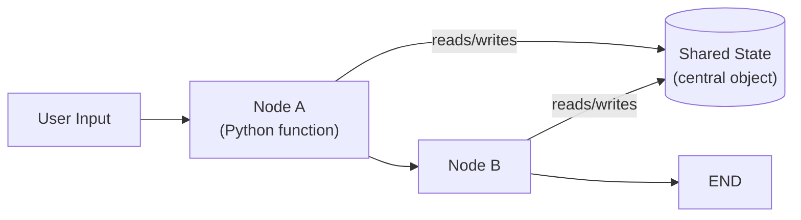

# Designing Stateful AI Agents using LangGraph — Video Notes

Condensed, transcript-based notes from a TMLC Academy hands-on session building 11 different agent architectures with LangGraph in a Google Colab notebook. See *Designing Stateful AI Agents using LangGraph - Transcript.md* in this folder for the full source recording transcript, and `AI Agents/notebooks/LangGraph Agents.ipynb` for the actual code. This is a long, code-heavy walkthrough with no companion slide deck — these notes focus on the *architecture* of each pattern (what shape the graph takes, and when you'd reach for it), since that's what survives a machine-transcribed coding session accurately; exact code syntax should be checked against the notebook itself, not this file.

**The core idea, in one picture:**

**The analogy that runs through this whole document 📋**

Without statefulness, every node in a workflow is an isolated island — you'd have to manually carry every input and output from one step to the next yourself. LangGraph's answer is a **shared clipboard** sitting in the middle of the workflow: every node can read what's already written on it, add its own notes, and pass it along. Nobody has to remember to hand information to the next person — it's just *there*, on the clipboard, for whoever needs it next. Every pattern in this session — sequential, router, parallel, reflect, human-in-the-loop, and the rest — is really just a different shape for who gets to look at the clipboard, and in what order.

---

## 1. What "Stateful" Actually Means Here

In any stateful system, information persists and is shared across every step of the workflow. LangGraph is a **graph**: many nodes, connected by edges, all reading from and writing to one **central state object**. Without that, each step would be isolated, and you'd need to manually thread inputs and outputs between them — which is roughly what plain LangChain forces you to do with long sequential chains.

Statefulness unlocks capabilities that would otherwise need to be hand-built:

- **Shared memory** — every node has read/write access to the same state dictionary.
- **Automatic persistence** — a checkpointer can save that state to a local database, SQLite, Postgres, or elsewhere.
- **Human-in-the-loop** — pause execution, get human input, and resume from exactly where it left off, using the saved state.
- **Time travel and replay** — since every node's inputs/outputs are checkpointed, you can trace exactly which node caused a failure in a multi-node system (useful for LLMOps-style debugging).
- **Multi-turn conversations** — previous history, tool results, and intermediate reasoning persist across turns without manual bookkeeping.

---

## 2. The Core Components

| Component | Role |
|---|---|
| **State** | The shared data store — declared upfront (via `TypedDict` or a Pydantic model) with the fields the workflow needs |
| **Nodes** | Python functions — each receives the current state, does work, and returns an update to it |
| **Edges** | Connect nodes; a normal edge always goes A→B, a **conditional edge** routes based on a condition |
| **Entry point** | Declares which node runs first when the graph starts |
| **StateGraph** | The container binding state, nodes, and edges together; produces a compiled, runnable `app` |
| **Checkpointer** | Saves state at any point — `MemorySaver` (local memory), `SqliteSaver`, `PostgresSaver` |

**How state updates work:** by default, a node's return value **overwrites** that state field. If a field is declared as a list (like a running message history), new items are **appended**, not replaced — controlled by a *reducer* function (LangGraph's `add_messages` is the built-in reducer for exactly this case). If you want different merge behavior, you write a custom reducer.

**The build pattern, every time:** define the state class → define each node as a function → set the entry point → add edges (plain or conditional) between nodes → `graph.compile()` → `app.invoke(input)`.

---

## 3. The 11 Agent Architecture Patterns

The session builds all eleven in one notebook, from simplest to most sophisticated. The last three sections group them by structural family.

### 1. Sequential (Fixed Linear Flow)

The simplest pattern: a fixed path, same sequence every time, no branching or looping. **Worked example:** an article-writing flow — `plan → write → review → end`. The plan node generates an outline from a topic; the write node drafts from that outline; the review node produces the final article. Each node only reads the state fields it actually needs (write only needs the outline, not the original topic).

**Best for:** pipelines, ETL workflows, document processing — anywhere the steps are always the same, in the same order.

### 2. Supervisor / Router

A supervisor node classifies the incoming query (e.g. "code," "math," or "general") and a **conditional edge** routes to the matching specialist node. If the model produces an unexpected category, route to a general-purpose fallback. Every specialist path ends the workflow directly — no routing back to the supervisor.

**Worked example:** ask a coding question → routes to the code specialist; ask a math question → routes to the math specialist.

**Best for:** multi-category queries, customer support triage — anywhere the first real decision is simply "which specialist should handle this."

### 3. Parallelization (Fan-Out / Aggregate)

Instead of routing to *one* node, call several nodes **at the same time** and combine their results. This one leans more on plain Python (using `concurrent.futures` and a thread pool) than on LangGraph-specific mechanics — the nodes run concurrently, and an aggregator node waits for all of them and merges the outputs.

**Worked example:** pros / cons / risks analysis — three nodes run in parallel, then an aggregator combines them into one executive summary.

**Best for:** anywhere inference speed matters and the sub-tasks are genuinely independent of each other.

### 4. Reflect / Critic

A generator produces a response; an evaluator checks it against some quality bar. If it fails, loop back and regenerate; if it passes, end. A `maxIterations` cap (the session uses 3) prevents an infinite retry loop from burning tokens forever — after the cap, either return the best attempt so far or a fallback message.

> ⚠️ **A real caveat from the session, worth remembering:** if the evaluator is *also* just an LLM call, it can be fooled — an LLM evaluating an LLM's wrong answer may still judge it "correct." For domain-specific tasks, a custom evaluator (rule-based checks, semantic-similarity metrics, or real precision/recall/factual-correctness scoring against ground truth) is a more trustworthy retry gate than another LLM call.

**Best for:** letting an agent self-correct on quality, especially when you have — or can build — a real evaluation signal beyond "ask another LLM."

### 5. Human-in-the-Loop

The graph is deliberately **paused** mid-execution — using `interrupt` — to wait for a human decision (approve / reject / edit), then **resumed** with a `Command(resume=...)` call once that decision arrives. This requires a checkpointer (so the paused state survives) and a **thread config** (a `configurable` dict with a thread/session ID) so the right paused execution gets resumed.

**Worked example:** an email-drafting agent drafts an email, pauses for human review. Approve → sends as-is. Edit → the human's replacement text is sent instead. Reject → workflow cancelled, nothing sent.

**Best for:** high-risk or sensitive automated actions. The session's own cautionary example: an AWS incident where an agent, without a human checkpoint, deleted a piece of infrastructure code and caused roughly 13 hours of impact — exactly the class of action that should never execute without a human in the loop.

### 6. Tool Use

An agent is equipped with one or more **tools** (plain Python functions, wired to the LLM via a `@tool`-style decorator). The LLM decides whether calling a tool is actually needed; if so, the tool executes and its result feeds back into the agent's reasoning before a final response is generated.

**Best for:** any task where the answer genuinely depends on data or an action the LLM can't produce from its own knowledge alone — a lookup, a calculation, an API call.

### 7. Network (Decentralized Multi-Agent)

Several agents (in the session's example: strategist, analyst, critic) can each call *any* of the others, rather than following one fixed path — a genuinely decentralized structure, with a max-iteration cap to prevent runaway looping between agents.

**Worked example:** asked whether a 10-person startup should adopt microservices, the graph moves strategist → analyst → strategist → analyst, hits the iteration cap, and terminates. A prompt tweak (telling the model its current iteration count, and nudging it toward the critic and then completion) can shape that behavior without hand-building a stricter structural guarantee.

**Best for:** situations where the right next agent to consult genuinely depends on what's been discussed so far, not a fixed sequence — at the cost of needing careful iteration limits so it doesn't loop forever.

### 8. Custom Multi-Agent (Fixed Workflow)

Multiple agents/steps, but the workflow itself is **always the same**, defined once by the developer rather than decided dynamically. **Worked example:** `intake → validate → process → format → end`, with an error-handling branch if validation fails.

**Best for:** anywhere you want the reliability of a fixed pipeline but the individual steps are complex enough to be worth modeling as separate nodes.

### 9. Planning (Planner → Executor → Synthesizer)

A planner generates a structured plan (the session's example produces JSON with a list of steps); an executor works through those steps — which can themselves run sequentially *or* in parallel, so this pattern can nest patterns #1 and #3 inside it; once every step is done, a synthesizer combines all the intermediate results into one final output.

**Worked example:** asked to plan how to study machine learning, the graph generates a five-step plan, executes each step, and the synthesizer combines them into a final structured report.

**Best for:** open-ended tasks that need to be broken into sub-steps first, where the number and nature of those steps isn't known in advance.

### 10. ReAct (Reason + Act)

Short for **Rea**son + **Act**: the agent thinks ("thought"), decides whether to call a tool ("action"), reads the tool's result ("observation"), and repeats — until it has enough information for a final answer. A max-iteration cap (5, in the session's example) again guards against infinite tool-calling loops.

**Worked example:** asked "what is Python, and can you summarize machine learning in 30 words," the agent calls a fact-lookup tool for each sub-question, observes both results, reasons over them, and produces one combined final answer.

**One line:** ReAct is the Reflect/Critic pattern (#4) and Tool Use (#6) combined — reason, act, observe, and keep re-reasoning until done, rather than a single tool call and a single quality check.

### 11. Team / Leader + Specialized Members

A **leader** agent can call on several **specialized member** agents (the session's example: marketing, engineering, legal), each bound to its own tools and its own curated prompt so it stays in its lane. Members can run sequentially or in parallel depending on design. Once the leader has collected every member's contribution, a synthesizer combines them into one final report.

**Worked example:** asked to plan an AI-powered SaaS code-review tool launch, marketing estimates go-to-market details, engineering estimates a six-month development timeline and cost, legal checks compliance — and the synthesizer merges all three into one coherent project report, resolving overlaps (e.g. two cost estimates that need to be combined into one total).

**Best for:** large projects or enterprise workflows needing a genuine hierarchical structure — this is the pattern the session flags as increasingly common in production: "create a team of agents that work together" to produce an entire project's worth of output.

---

## Pattern Cheat Sheet

| Pattern | Shape | Reach for it when... |
|---|---|---|
| Sequential | Fixed linear path | The steps never change — pipelines, ETL, document processing |
| Supervisor / Router | One classify step, then branch | You need to pick the right specialist among several categories |
| Parallelization | Fan-out, then aggregate | Sub-tasks are independent and speed matters |
| Reflect / Critic | Generate → evaluate → retry loop | The agent should self-correct against a quality bar |
| Human-in-the-Loop | Pause → human decides → resume | The action is high-risk or sensitive enough to need a checkpoint |
| Tool Use | Agent decides whether to call a tool | The answer needs data or action the LLM can't produce alone |
| Network | Agents call each other, no fixed order | The right next step genuinely depends on what's been discussed |
| Custom Multi-Agent | Fixed multi-step workflow | You want a reliable pipeline built from several distinct steps |
| Planning | Plan → execute steps → synthesize | The task needs to be broken into sub-steps not known in advance |
| ReAct | Reason → act → observe, repeat | The agent needs to think *and* use tools iteratively |
| Team / Leader | Leader delegates to specialists, then synthesizes | The job is genuinely large enough to need a hierarchical team |

---

## Key Takeaways

1. **Statefulness is the foundation everything else builds on** — a shared state object that every node can read and write is what makes memory, checkpointing, human-in-the-loop, and multi-turn conversation possible without manual bookkeeping.
2. **Every pattern is built from the same five components** — state, nodes, edges (including conditional edges), a StateGraph container, and an optional checkpointer.
3. **Start simple, add complexity only as needed** — pick the simplest pattern that fits (often sequential), and move to routing, parallelism, or hierarchy only once the domain actually demands it.
4. **Human-in-the-loop is critical for high-risk actions** — the session's own cautionary example (an agent deleting AWS infrastructure with ~13 hours of impact) is exactly the failure mode a human checkpoint exists to prevent.
5. **Real production systems tend to combine patterns** — a leader/team architecture built from multiple specialist agents, each internally using whichever pattern suits its own sub-task, is the natural end state as an agentic system grows.

---

## 🎤 Interview Prep — Mock Interview (LangGraph Architecture Patterns)

*Same two-layer format as the other Video Notes files in this repo: a plain-language answer with an example, then a crisp, technically precise version.*

---

**🎙️ Interview Q1:** "What does 'stateful' actually mean in LangGraph, and why does it matter compared to a plain LangChain sequential chain?"

**✅ Strong answer:** "It means every node in the graph reads from and writes to one shared state object, instead of each step only seeing whatever the previous step explicitly handed it. With a plain LangChain-style chain, you're manually wiring each step's output into the next step's input — if five nodes need the same piece of context, you're threading it through by hand five times. With LangGraph's state, that context is just sitting on a shared object every node can reach into. That's also what makes checkpointing, human-in-the-loop, and multi-turn memory possible — they all depend on there being one central place that represents 'everything that's happened so far' that can be saved, paused, and resumed."

**🎯 Standard Interview Answer:** "Statefulness in LangGraph refers to a shared, typed state object (via TypedDict or a Pydantic model) that every node in the graph can read and write, with reducer functions controlling merge behavior for fields like message lists. This decouples data flow from control flow — nodes don't need explicit input/output wiring to each other, since they all operate against the same state. This is the architectural prerequisite for checkpointing (persisting state), human-in-the-loop (pausing and resuming from persisted state), and multi-turn memory (state persisting across invocations of the same thread)."

---

**🎙️ Interview Q2:** "Walk me through how human-in-the-loop actually works mechanically in LangGraph — what has to be in place for `interrupt` and `resume` to function?"

**✅ Strong answer:** "Two things need to exist before interrupt/resume will work at all: a checkpointer, so the paused state is actually saved somewhere rather than lost, and a thread config — basically a session ID — so the system knows *which* paused execution to resume when the human's decision comes back. When the graph hits the `interrupt` call, it pauses right there and the state gets checkpointed. Later, instead of calling `invoke` again — which would restart the graph — you call it with a `Command(resume=...)` carrying the human's decision, and pass the same thread config so it finds the right paused state and continues from exactly that node, not from the start."

**🎯 Standard Interview Answer:** "Human-in-the-loop requires a checkpointer (MemorySaver, SqliteSaver, or PostgresSaver) to persist state at the interrupt point, and a `configurable` thread ID that scopes which execution is being resumed. The `interrupt` call within a node pauses execution and checkpoints state; resumption is triggered via `Command(resume=<decision>)` against that same thread ID, rather than a fresh `invoke`, which would re-enter the graph at its entry point instead of continuing from the interrupted node."

---

**🎙️ Interview Q3:** "The session mentions that a Reflect/Critic loop can fail if the evaluator is also just an LLM. Why, and how would you actually fix that in a real system?"

**✅ Strong answer:** "Because if both the generator and the evaluator are LLM calls, they share the same blind spots — an LLM that gets a fact wrong can just as easily be fooled by its own wrong answer when asked to check it, since it's not actually comparing against ground truth, it's just pattern-matching on 'does this look like a reasonable answer.' The fix is giving the evaluator something the generator doesn't have: a real signal outside the LLM's own judgment — rule-based checks for a domain you understand, semantic-similarity scoring against a known-good answer, or real precision/recall/factual-correctness metrics if you have ground truth to check against. The evaluator needs an independent source of truth, not just another opinion from the same kind of model that made the mistake."

**🎯 Standard Interview Answer:** "LLM-as-evaluator suffers from correlated failure modes with the LLM-as-generator, since both are subject to the same class of reasoning errors and lack grounding in verifiable fact — an evaluator LLM assesses plausibility, not correctness. Mitigations include domain-specific rule-based validation, semantic-similarity metrics against reference answers, or standard NLP/IR metrics (precision, recall, factual-correctness scoring) when ground truth is available — any of which give the retry loop an evaluation signal that's independent of the generator's own failure modes, rather than a second LLM call that can fail in the same way as the first."

---

## Q&A

Every question asked while working through this file gets logged here, numbered sequentially as `### Q1:`, `### Q2:` … Each answer follows the same shape used across this repo's other Video Notes files:

- The heading is the question **as asked**.
- A one-sentence **bolded verdict** opens the answer, using ✅ / ❌ for confirm-or-correct questions.
- A concrete **analogy** carries the explanation, plus a comparison table when two concepts are being contrasted.
- A bolded **One line:** summary closes the answer.

*(No questions logged yet — the first one asked will be added below as `### Q1:`.)*
