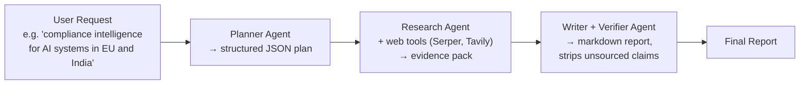

# Market Research Copilot — Video Notes

Condensed, transcript-based notes from a TMLC Academy hands-on session building a market research agent twice — once with CrewAI, once with LangGraph — to compare how much abstraction each framework buys you. See *Market Research Copilot - Transcript.md* in this folder for the full source recording transcript, and `AI Agents/notebooks/` for the underlying code. No companion slide deck for this session.

**The core idea, in one picture:**



**The analogy that runs through this whole document 🕵️**

A single do-everything agent asked to "research this and write a report" is like hiring one person to be the detective, the fact-checker, and the ghostwriter all at once — they'll cut corners somewhere, and you'll never quite know which part went wrong when the final report is off. This session splits that one overloaded role into three specialists who each do one job and hand off to the next: a **planner** (decide what to investigate), a **researcher** (go find evidence), and a **writer/verifier** (turn evidence into a report, and strip out anything that can't be backed by a source). Every claim in the final report should be traceable back to a URL — the whole architecture exists to make that traceability possible.

---

## 1. Why Market Research Needs a Specialized Agent

Manual market/compliance research is slow and inconsistent: unstructured data from multiple sources, 6–12 hours per topic, inconsistent sourcing, no structured validation, and results that are hard to audit. The goal isn't just to automate *data collection* (scraping already does that) — it's to add **structure, auditability, and a repeatable workflow** to the research itself.

**Definition used in the session:** a market research agent is *"an orchestrated AI system that decomposes a complex research request into structured tasks and gathers verifiable evidence against which a decision-grade output can be produced."*

**What makes it "agentic," specifically:**
- **Goal-driven** — every step has its own explicit goal, input, and output.
- **Multi-step** — the system reasons across a chain of steps, not one prompt→response.
- **Tool use** — it can reach outside itself (web search) to gather real evidence.
- **Structured output** — the result is a report, not a paragraph.
- **Controlled execution flow** — in this session, specifically a sequential pipeline.

---

## 2. Why Planner–Executor, and Not Something Else

Before building, the session compares four patterns to justify the choice:

| Pattern | Shape | Trade-off |
|---|---|---|
| **Sequential** | Fixed order, A→B→C | Deterministic, fully auditable — easy to know exactly where something failed |
| **Parallel** | Multiple agents run at once | Faster, but needs an aggregation step to combine results |
| **Reflective / Critic** | A second agent checks the first's output and can send it back for a retry | Catches errors, at the cost of extra LLM calls and latency |
| **Hierarchical** | A manager agent delegates to worker agents | Good for delegation, but more moving parts to coordinate |

**Planner–executor isn't a fifth, separate pattern** — it's a role split (plan vs. execute) that can itself be built *sequentially or in parallel* internally. This session chooses **planner–executor running sequentially**, specifically because the goal right now is to demonstrate why clarity and control over the workflow matters — not to build the fastest or most sophisticated version.

**What breaks without a planner:** a single do-everything agent can hallucinate, drift away from the actual scope of the request, and produce output that's hard to verify against what was actually asked. Splitting planning out gives you explicit goals, defined focus areas, generated sub-queries, and a **repeatability factor** — running the same research request twice should produce a similarly-structured plan both times, which is exactly what you want from something meant to be auditable.

---

## 3. Build #1 — CrewAI Version

CrewAI's abstractions map directly onto the three-role structure: an **Agent** (role + capability), a **Task** (a contract of work — what exactly to do), and a **Crew** (binds agents and tasks together under an execution mode — here, `Process.sequential`).

### The three agents

| Agent | Job | Tools |
|---|---|---|
| **Planner** | Turn the user request into a small, structured research plan + search queries | None — just structures the request |
| **Researcher** | Find reliable sources, extract facts with URLs attached | `SerperDevTool` + `TavilySearchTool` (two different web-search providers) |
| **Writer + Verifier** | Write a clean report; strip or mark "uncertain" any claim with no source URL | None — works from what the researcher already gathered |

**Why two different search tools, not one:** Serper and Tavily return different results and different rankings for the same query. For a compliance-research use case specifically, having facts cross-verifiable across *multiple* sources matters more than using whichever single tool is fastest.

**The plan schema** (a Pydantic model, so the planner's output is validated structure, not free text) includes: `goal`, `regions` (which jurisdictions matter), `focus_areas`, `queries` (the actual search strings to run), and `evidence_rules` — explicit rules like *"every important claim must have a source URL; if unsure, say uncertain instead of guessing."*

**Why explicit rules matter:** without them, the model tends to phrase things inconsistently between runs — the wording, structure, and completeness of "cite a source" drift unless it's spelled out. This is the same repeatability concern from Section 2, applied at the prompt level.

**The final report structure**, defined explicitly in the writer/verifier task: scope and assumptions, key obligations, cross-border transfer notes, enforcement signals from the last 12 months, and recommended actions — plus a hard rule to never give legal advice, and a small claim-sources table so every claim's URL is visible at a glance.

**Running it:** `crew.kickoff()`, with `verbose=True` so every stage (task started, agent's input, agent's final answer, task completed) prints to the terminal — genuinely useful for understanding what each agent actually received and produced, not just the final report.

> 📋 **Note on data flow:** this pipeline is strictly **forward-only** — no feedback loop, no critic step sending work back for revision. Each stage depends only on the output of the one before it. That's a deliberate simplicity choice for this session, not a limitation of the pattern itself (a critic/reflective loop could be added on top later).

---

## 4. Build #2 — LangGraph Version

The second build tackles the same problem — market research for a SaaS product, this time using Gemini and the Serper API — but built node-by-node in LangGraph instead of through CrewAI's abstractions, with a Streamlit front end.

**The graph, five nodes, strictly sequential:**

```
pass_query → discover_via_serp → clean_data → scrape_news → generate_report
```

- **pass_query** — calls a "research plan generator" that identifies the product, category, search questions, and news queries, storing them in the graph's shared state.
- **discover_via_serp** — runs the actual Google search via the Serper API.
- **clean_data** — filters out low-signal results (e.g. generic tutorial content) and removes duplicate URLs before they're wasted on scraping.
- **scrape_news** — rather than relying on search-result snippets alone, this node actually scrapes the full article text from each URL (using a library called Trafilatura), giving the writer step richer source material than snippets alone would.
- **generate_report** — sends all the collected, cleaned data to Gemini to synthesize the final report.

**Code organization** (worth noting as a pattern in itself): LLM prompts live in one `llm` folder, the LangGraph structure lives in a `graph` folder, and data-cleaning logic lives in a `cleaners` folder — separating "what the model is asked to do" from "how the workflow is wired" from "how the data is scrubbed," so each concern can be changed independently.

**Visualizing the graph:** LangGraph has a built-in function to render the compiled graph as a Mermaid-style PNG (`draw_mermaid_png()`) — genuinely useful for confirming the graph's actual shape matches what you intended, especially once branching or looping gets involved.

**Output as JSON, not just markdown:** the final report can be downloaded as JSON as well as markdown — meaning the exact same backend can power a Streamlit prototype *or* feed a proper front end (React, Angular, anything), since the data is already structured rather than locked into one rendering.

### CrewAI vs. LangGraph — the actual trade-off, from the session

| | CrewAI | LangGraph |
|---|---|---|
| Abstraction level | High — Agent/Task/Crew abstractions do a lot of the wiring for you | Low — you define every node and edge yourself |
| Speed to build | Faster for straightforward pipelines | Slower, more code up front |
| Control | Limited to what CrewAI's abstractions expose | Full control over every step and how data flows between them |
| Best fit | Simpler, well-understood workflows; rapid prototyping | Growing complexity, custom logic, needing to scale past what the framework abstracts away |

**One line from the session, worth remembering:** CrewAI's abstractions are great until a project's complexity outgrows what they let you customize — at that point, LangGraph's lower-level control (defining every node yourself) stops being extra work and starts being the thing that actually saves you.

---

## 5. What's Deliberately Missing (and Why)

Neither build here is "production complete" — and the session is explicit about *why* those gaps are left in place at this stage of the course, not treated as oversights:

- **Retry logic** — if the planner's structured output fails to parse, retry rather than silently failing.
- **A caching/memory layer** — avoid re-running identical research from scratch; recall and reuse prior results.
- **Cost governance** — a budget per request, since unbounded web research across many sources can burn a lot of tokens fast.
- **Parallelization** — tool calls or nodes that don't depend on each other could run concurrently rather than one after another.

The session's framing: **architectural maturity is incremental.** You can't design all of this in up front — you build the simplest working version, observe how the model actually behaves with real tools and real data, and add fallback logic, caching, and cost controls as you learn where the system actually needs them. These specific gaps are left for the later LLMOps/deployment portion of the course, where they're covered properly.

---

## 6. From the Live Q&A (worth keeping)

- **"If two sequential agents use different LLMs, will there be a conflict between their outputs?"** No — each agent in a sequential pipeline just receives text (or structured) input and acts on it; it has no dependency on which model produced that input. The one real risk: if one step is generating a *prompt or instruction* for the next model to follow, prompting conventions that work well for one provider (say, OpenAI) don't always transfer cleanly to another (say, Anthropic) — but for plain task-based hand-offs, mixing providers across a pipeline is not itself a problem.
- **CrewAI vs. Google ADK:** CrewAI is built for flexible multi-agent collaboration and rapid prototyping. Google ADK is the better fit once you're integrating more complex, multi-protocol setups — things like MCP or A2A agent-to-agent collaboration. For simpler systems that don't need that protocol-level complexity, CrewAI remains the more practical choice.
- **Deploying this to an internal server:** wrap the existing script behind a FastAPI endpoint (directly reusing the pattern from the previous session), and for a closed-source model like OpenAI's, a slim Python 3.10/3.11 Docker image is enough — no GPU requirement. That changes entirely if you swap to a self-hosted open-source model (via Ollama or Hugging Face): then the Docker setup needs GPU access and up-to-date NVIDIA drivers, and the model's quantization level becomes a real trade-off between inference speed and accuracy.
- **Systematic prompting resources:** the instructor points to promptingguide.ai as a reference covering zero-shot, few-shot, and chain-of-thought prompting patterns with examples — worth consulting when designing a prompt for a specific task/model combination rather than guessing at structure.
- **Free API keys for this exercise:** Google Gemini offers a free tier (OpenAI does not); for web search, Serper and Tavily both offer a free monthly quota (around 1,000 requests/month in the session's telling) that resets monthly.

---

## Key Takeaways

1. **A market research agent's job isn't just data collection — it's adding structure, auditability, and repeatability** to what would otherwise be inconsistent manual research.
2. **Planner–executor splits "decide what to investigate" from "go investigate"** — and can itself be sequential or parallel internally, it isn't a fifth pattern competing with sequential/parallel/reflective/hierarchical.
3. **Two independent search tools beat one** when cross-verifiable evidence matters more than speed — this session's compliance-research use case is exactly that kind of task.
4. **CrewAI trades control for speed of building; LangGraph trades speed of building for control** — reach for CrewAI when the workflow is simple and well-understood, and for LangGraph once you need to customize past what a framework's abstractions expose.
5. **Production-readiness (retry logic, caching, cost governance, parallelization) is added incrementally**, once you've actually observed how the system behaves — not designed perfectly from the very first build.

---

## Q&A

Every question asked while working through this file gets logged here, numbered sequentially as `### Q1:`, `### Q2:` … Each answer follows the same shape used across this repo's other Video Notes files:

- The heading is the question **as asked**.
- A one-sentence **bolded verdict** opens the answer, using ✅ / ❌ for confirm-or-correct questions.
- A concrete **analogy** carries the explanation, plus a comparison table when two concepts are being contrasted.
- A bolded **One line:** summary closes the answer.

*(No questions logged yet — the first one asked will be added below as `### Q1:`.)*
