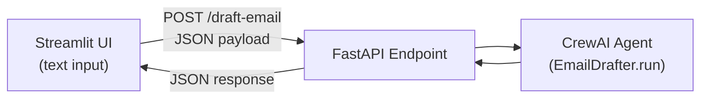

# Serving AI Agent with FastAPI — Video Notes

Condensed, transcript-based notes from a TMLC Academy hands-on session on taking an agent out of a notebook and serving it as a real API — using FastAPI, Pydantic validation, Postman, and a Streamlit front end, wrapped around the CrewAI email-drafter agent from an earlier session. See *Serving AI Agent with FastAPI - Transcript.md* in this folder for the full source recording transcript, and `AI Agents/notebooks/` for the underlying CrewAI agent code. No companion slide deck for this session; it's largely live Q&A over a shared screen, so these notes focus on the concepts and the shape of the final architecture rather than exact code.

**The core idea, in one picture:**

**The analogy that runs through this whole document 🏪**

A working agent in a notebook is like a chef who can cook a great meal — but only in their own kitchen, for themselves. **Serving** the agent is opening a restaurant: a menu (the API endpoints), a front counter that takes orders in a standard format (Pydantic validation), and a door that anyone — a website, a mobile app, a Streamlit UI — can walk through to place an order and get a meal back, without ever needing to know how the kitchen works. FastAPI is the restaurant infrastructure; the agent itself never has to change to be "served" this way — you're just wrapping it in a standard interface.

---

## 1. Batch vs. Online Serving

Before writing any code, the session frames two ways a model or agent can be "served":

- **Batch (static) serving** — queries pile up and get processed together at some interval (every 6 hours, every 12 hours). Users wait for the next batch run, not an instant answer.
- **Online serving** — a user sends a query and gets a response in real time — a few seconds, however long the pipeline or agent actually takes to run.

This session is entirely about the **online** case: turning a working agent into something that answers requests as they arrive.

---

## 2. HTTP Basics: The Four Verbs

Any API — not just FastAPI — is built around four request types:

| Verb | Purpose |
|---|---|
| **GET** | Retrieve data from the server |
| **POST** | Send (create) data on the server |
| **PUT** | Update existing data on the server |
| **DELETE** | Remove data from the server |

For agent/model-serving work specifically, **GET and POST cover almost everything** — you're usually either fetching a result or sending input for the agent to process. PUT and DELETE come up far less often in this context.

> 🏪 **Restaurant analogy, continued:** GET is "what's on the menu / what did I already order" — read-only. POST is "here's my order" — you're sending something new to be acted on. PUT is "actually, change my order." DELETE is "cancel my order." A typical agent-serving API is mostly people placing orders (POST) and checking results (GET).

---

## 3. FastAPI Basics

**FastAPI** is a high-performance Python web framework — the session frames it as the modern successor to Django and Flask for this kind of work, and highlights it as one of the fastest-growing API frameworks in Python.

**Pydantic** is FastAPI's validation layer. You define a model (a class inheriting from Pydantic's `BaseModel`) describing exactly what shape valid input has to take — field types, length limits, "must be greater than zero," optional-vs-required — and FastAPI rejects anything that doesn't match *before* your code ever runs. **Worked example from the session:** an `Item` model with `name` (string, max length 50), `description` (optional string), `price` (float, must be > 0), and `on_offer` (boolean, defaults to false). Passing a negative price, or a name over 50 characters, throws a validation error automatically — no manual `if` checks required.

**The basic pattern:**
1. `app = FastAPI()` — this app object is what everything gets registered against.
2. Define your Pydantic model(s) for request/response validation.
3. Define route functions decorated with the HTTP verb they respond to (`@app.get(...)`, `@app.post(...)`, etc.).
4. Run it with `uvicorn <filename>:app` — e.g. `uvicorn main:app`.

**Two developer-experience flags worth knowing:**
- `--reload` — auto-restarts the server whenever you save a code change, so you don't have to manually stop/restart during development.
- `--port <number>` — run on a specific port instead of the 8000 default; useful when the default port is already taken, or when deploying somewhere that assigns a specific port.

**The built-in Swagger UI** (`/docs`) is one of FastAPI's most useful features — it auto-generates an interactive page listing every endpoint, where you can fill in parameters and send real test requests without writing any client code at all.

---

## 4. CRUD Demo Walkthrough

The session builds a simple in-memory "database" (just a Python dictionary — no real database) with a `GET /items` (list everything), `POST /items` (add an item, returns HTTP 201 on success, 400 if the ID already exists), a per-ID `GET /items/{id}` (404 if not found), `PUT` (update an item, 200 on success), and `DELETE`. This is the classic **CRUD** pattern — Create, Read, Update, Delete — demonstrated end to end via the Swagger UI before moving to the real agent.

**Status codes used deliberately in the demo:** 200 (success), 201 (created), 400 (bad request — e.g. duplicate ID), 404 (not found). Returning the right status code, not just a message, is what lets any client program (not just a human reading the response) tell success from failure.

**On connecting to a real database instead of a dictionary:** the session sketches this briefly — swap the dictionary for a database connector (MySQL is the example given), open a connection and a cursor, and replace dictionary writes with `cursor.execute("INSERT INTO ...")`-style SQL calls. The API shape doesn't change; only what's behind the endpoint does.

### Postman as an alternative to Swagger UI

**Postman** is introduced as the tool teams use once an API isn't casually browsable — for example, once an organization puts authentication in front of it, and developers need a documented, shareable way to hit each endpoint. The session replicates the GET/POST demo in Postman: paste the URL, for POST requests select **Body → raw → JSON** and paste the payload, and Postman can even auto-generate the equivalent Python `requests` code for you (a small but genuinely useful feature for handing an API off to another developer).

---

## 5. Serving the Real Agent

With the CRUD basics covered, the session pivots to the actual point: wrapping the **CrewAI email-drafter agent** from an earlier lesson behind a FastAPI endpoint.

**The pattern, stripped to its essentials:**
1. Define a Pydantic model for the request — here, just one field: `input_email: str`.
2. Initialize the agent class alongside the FastAPI app.
3. A `POST /draft-email` route receives the validated request, calls the agent's `.run(...)` method (CrewAI's `crew.kickoff()` under the hood) with the input email, and returns whatever the agent produces as JSON.
4. Errors are caught and returned as HTTP 500.

> 🔑 **The key insight from the session's own Q&A:** FastAPI and the agent framework (CrewAI, in this case) *don't* interact with each other directly. FastAPI is not "talking to" CrewAI — the notebook code that defines and runs the agent is simply *placed inside* a FastAPI route function. Whenever a request hits that route, that code runs, like any other Python function call. FastAPI is a wrapper around existing code, not a new integration to build.

### Streamlit as the front end

A minimal Streamlit app provides the actual user interface: a text box for the input email, and a button that calls Python's `requests.post(...)` against the FastAPI endpoint's URL with the input as a JSON payload. The response comes back as JSON, and the session walks through the exact chain needed to pull the actual drafted text out of it: `response.json()` → `.get("drafted_email")` (returning a clear "no email drafted" fallback if that key is missing) → then indexing into a nested `"raw"` key inside that, since that's where CrewAI's own response happened to nest its final text.

> ⚠️ **A real bug hit live in the session, worth remembering:** the FastAPI server was started on port 8001, but the Streamlit app was still pointed at the default port 8000 — so requests silently failed until both sides were pointed at the same port. A small, easy-to-miss mismatch, and a good reminder to double check the port on both ends of any client/server setup.

---

## 6. Beyond localhost: Where FastAPI Fits in MLOps/LLMOps

The session closes the demo by placing FastAPI in a bigger picture: it's one tool among many in an MLOps/LLMOps/AIOps/DataOps pipeline — alongside things like MLflow, EvidentlyAI, DeepChecks, Docker, Kubernetes, CI/CD pipelines, GitHub Actions, Ansible, and Jenkins. **No single pipeline needs every tool** — each one serves a specific purpose, and FastAPI's specific purpose is turning a notebook-bound model or agent into something reachable by *anything*: a Streamlit prototype, a real website, an Android or iOS app. The one requirement for that to actually be useful beyond your own machine: it has to be deployed somewhere reachable — AWS, Azure, or GCP — not left running on `localhost`.

---

## 7. From the Live Q&A (worth keeping)

- **What can these agents actually automate?** Examples raised live: blog-writing automation (already built and shared on the course portal), and YouTube-video automation — either the "consume" direction (transcribe a video, summarize it, or build a RAG-style chat service over its content) or the "produce" direction (an agent pipeline that takes a video idea and generates a title, script, and — using models like Sora or Google's video-generation models — the video itself, then posts it via the YouTube API). The instructor's framing: this is achievable today, gated mainly by how capable the underlying generation models are, not by the agent orchestration.
- **Sequential vs. hierarchical multi-agent structure, in CrewAI terms:** you can chain agents one after another (sequential), or build a hierarchy where several agents' outputs get merged by another agent, and that merged result feeds into a further agent — essentially the same shape as the "team/leader" pattern from the LangGraph session, expressed in CrewAI instead.
- **Framework comparison, straight from the instructor:** PhiData is noted as simpler than LangChain/LlamaIndex, with fast-growing adoption and tutorials. **LangGraph is positioned as the better choice specifically when you need real control over the flow** — defining nodes explicitly, wiring exactly how they connect (e.g. a chatbot node that can call a tool node and get the result routed back) — which is exactly the kind of fine-grained control the previous session's 11 patterns were built to demonstrate. The course's own roadmap: Corrective RAG and Agentic RAG, covered via LangGraph, are coming up next specifically *because* that level of control is needed for those architectures.

---

## Key Takeaways

1. **Serving is a separate step from building** — a working notebook agent isn't reachable by anyone else until it's wrapped in an API.
2. **FastAPI + Pydantic gives you validated, self-documenting endpoints for free** — the `/docs` Swagger UI comes built in, with no extra work.
3. **FastAPI doesn't "integrate" with your agent framework — it wraps it.** Whatever code ran your agent in a notebook goes, largely unchanged, inside a route function.
4. **Status codes matter** — 200/201/400/404/500 let any client program distinguish success from failure without parsing a message string.
5. **The stack in this session (Streamlit → FastAPI → CrewAI agent) generalizes** — swap the front end for a real website or mobile app, swap the in-memory dictionary for a real database, and swap the agent framework for LangGraph, LangChain, or anything else — the serving pattern underneath stays the same.

---

## Q&A

Every question asked while working through this file gets logged here, numbered sequentially as `### Q1:`, `### Q2:` … Each answer follows the same shape used across this repo's other Video Notes files:

- The heading is the question **as asked**.
- A one-sentence **bolded verdict** opens the answer, using ✅ / ❌ for confirm-or-correct questions.
- A concrete **analogy** carries the explanation, plus a comparison table when two concepts are being contrasted.
- A bolded **One line:** summary closes the answer.

*(No questions logged yet — the first one asked will be added below as `### Q1:`.)*
