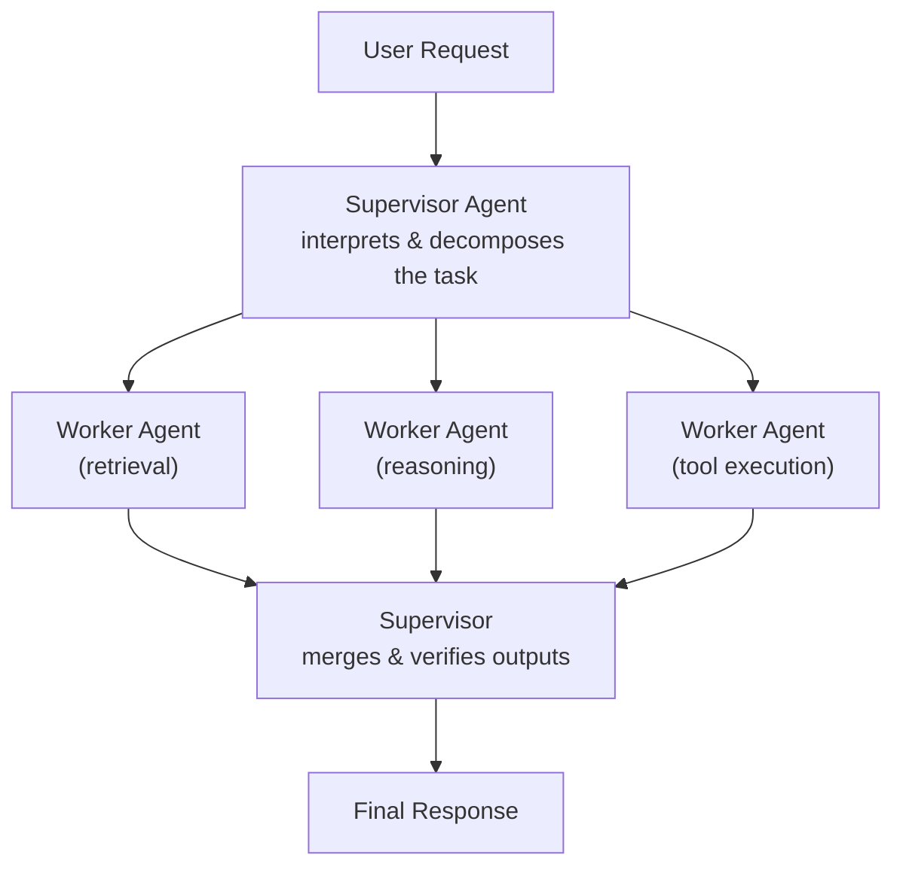

# What is a Multi-Agent System? — Video Notes

Condensed, transcript-based notes from a TMLC Academy session introducing multi-agent systems. See *What is a Multi-Agent System - Transcript.md* in this folder for the full source recording transcript. No dedicated reading deck exists for this session, so the diagram below is drawn from the session's own description of the supervisor-worker pattern rather than a slide image.

**The core idea, in one picture:**

**The analogy that runs through this whole document 🏢**

A single agent is one person trying to do an entire company's work alone — task understanding, execution, and verification, all by themselves, one thing at a time. A multi-agent system is that same company once it hires a **team**: a manager who breaks the big job into pieces and hands each piece to the specialist best suited for it, specialists who each do their focused part and report back, and a way for everyone to actually talk to each other and see the same shared notes. Every concept in this session — why multi-agent systems exist, the four building blocks, the four collaboration patterns — is really just describing how you'd organize *any* team, applied to AI agents instead of people.

---

## 1. Why One Agent Isn't Always Enough

A single-agent setup is one LLM loop responsible for understanding the task, decomposing it, executing it, *and* verifying the result. That works for simple, linear tasks — but it quickly becomes a bottleneck once the work is complex, distributed, or needs several kinds of specialized intelligence at once.

A **multi-agent system** distributes that same work across several specialized agents that coordinate through message passing or shared state. This buys three things a single agent structurally can't give you:

- **Specialization** — each agent is tuned for one capability (summarization, retrieval, reasoning, API orchestration) instead of one model trying to be good at everything.
- **Scalability** — tasks run in parallel, across different tools, models, and compute environments.
- **Reliability** — if one agent's output is uncertain, another agent can verify, correct, or augment it, rather than a single point of failure deciding everything alone.

**One line:** a single agent does the whole job serially and checks its own work; a multi-agent system splits the job, runs pieces in parallel, and lets agents cross-check each other.

---

## 2. The Four Core Components

Every multi-agent system is built from the same four layers:

| Component | Role |
|---|---|
| **Agents** | Specialized workers focused on one job — reasoning, retrieval, planning, or tool execution |
| **Coordinator / Orchestrator** | The decision-maker: assigns tasks, resolves conflicts, keeps the system moving toward the final goal |
| **Shared memory / context store** | Holds intermediate results, conversation state, and task progress, so every agent sees the same source of truth |
| **Communication protocol** | Messages, API calls, or graph edges — how agents actually talk to each other and to external tools |

> 🏢 **Analogy, continued:** agents are the specialists on the team. The coordinator is the manager, deciding who does what and settling disagreements. Shared memory is the shared team doc everyone reads and writes to, so nobody's working off stale information. The communication protocol is just... how they actually talk to each other — Slack messages, a shared ticket system, whatever the mechanism is.

---

## 3. Four Collaboration Patterns

These are four different ways to organize that team, each suited to a different style of task.

### Planner–Executor

A **planner** agent breaks the user's request into a structured sequence of steps — essentially generating a mini-workflow. An **executor** agent then performs each step in that sequence: calling APIs, running tools, retrieving data, generating intermediate outputs.

**Why it's useful:** separating "decide the steps" from "carry out the steps" gives deterministic execution, clearer reasoning, and much easier debugging — which is why this is one of the most widely used patterns in real agentic systems.

### Supervisor–Worker

The user talks to a single **supervisor** agent. The supervisor interprets the query, breaks it into subtasks, and decides which specialized **worker** agents are best suited for each part. Each worker handles its own focused capability — possibly invoking several tools or steps of its own — and the supervisor collects, merges, and verifies all the intermediate outputs before returning the final response.

**Why it's useful:** this pattern mirrors how real organizations actually work, which is exactly why it scales well to complex, multi-step tasks that genuinely need several different competencies running in parallel.

### Critic–Refiner

The supervisor routes the query to a **response generator**, which produces a fast, broad first draft. That draft then goes to a **critic-refiner** agent, which evaluates it for correctness, completeness, style, safety, or domain-specific constraints — and can rewrite it, fix hallucinations, or add missing detail. The refined result goes back to the supervisor, which may run additional checks before sending the final, polished response to the user.

**Why it's useful:** this is the pattern to reach for in high-stakes domains, where you genuinely need *both* fast creative generation *and* careful verification, and don't want either quality to come at the expense of the other.

### Peer-to-Peer (Decentralized)

Not every architecture needs a central orchestrator. In a peer-to-peer setup, agents collaborate directly — for example, a knowledge agent might trigger a memory agent to update information without waiting for a supervisor to coordinate the interaction.

**Why it's useful:** this pattern is lightweight and reactive, well-suited to agents that need to synchronize state continuously or perform autonomous background updates without a manager in the loop for every single interaction.

| Pattern | Structure | Best suited for |
|---|---|---|
| Planner–Executor | Plan first, then execute the plan step by step | Deterministic, well-defined multi-step tasks |
| Supervisor–Worker | Central supervisor delegates to specialized workers | Complex tasks needing several competencies in parallel |
| Critic–Refiner | Generate a draft, then a second agent verifies/improves it | High-stakes domains needing both speed and verification |
| Peer-to-Peer | No central orchestrator — agents trigger each other directly | Continuous state sync, autonomous background work |

---

## 4. Real-World Applications

| Domain | How agents split the work |
|---|---|
| **Customer support automation** | A planner agent identifies intent → a response agent drafts the answer → an evaluator verifies accuracy and tone before sending it |
| **Enterprise AI assistance** | One agent retrieves data → another generates structured reports → a third validates compliance (especially important in regulated industries) |
| **Research co-pilots** | A researcher agent explores sources → an extractor pulls relevant information → a summarizer condenses it into a clean, usable output |
| **Software automation** | A planner breaks down tasks → an agent interacts with the UI/workflow → a validator checks the results meet expectations |

Across every one of these, the point is the same: multi-agent systems let AI behave like a **coordinated team**, not a standalone model trying to do everything itself.

---

## Key Takeaways

1. **A single agent hits a bottleneck on complex work** — one loop doing understanding, execution, and verification serially doesn't scale.
2. **Multi-agent systems buy specialization, scalability, and reliability** by distributing work across agents that can run in parallel and cross-check each other.
3. **Four components make it work:** the agents themselves, a coordinator, shared memory, and a communication protocol.
4. **Four collaboration patterns cover most real designs:** planner-executor (deterministic step-by-step), supervisor-worker (parallel specialists), critic-refiner (draft then verify), and peer-to-peer (no central orchestrator).
5. **The pattern choice should match the task** — deterministic workflows want planner-executor, high-stakes content wants critic-refiner, continuous background sync wants peer-to-peer.

---

## 🎤 Interview Prep — Mock Interview (Multi-Agent Systems)

*Same two-layer format as the other Video Notes files in this repo: a plain-language answer with an example, then a crisp, technically precise version.*

---

**🎙️ Interview Q1:** "When would you reach for a multi-agent system instead of just making one agent's prompt more sophisticated?"

**✅ Strong answer:** "When the task genuinely needs different *kinds* of competence, not just a smarter version of one competence. If a single agent is trying to retrieve data, reason over it, generate a report, *and* check that report for compliance, you're asking one model to be great at four different jobs at once — and if it gets any one of them wrong, there's nobody catching the mistake. Splitting that into a retrieval agent, a reasoning agent, a generation agent, and a compliance-checking agent means each one is only responsible for what it's actually good at, and the ones downstream can catch problems from the ones upstream. I'd reach for multi-agent specifically when reliability and parallel scaling matter, not just when a task has multiple steps — a single agent with a good planner-executor loop can already handle multi-step tasks."

**🎯 Standard Interview Answer:** "Multi-agent architectures are justified when a task requires functionally distinct competencies that benefit from independent specialization and cross-verification, or when parallel execution across tools/compute is needed for throughput. A single agent with a planning loop can still handle multi-step tasks; the deciding factor for going multi-agent is usually reliability (independent verification reduces single-point-of-failure error) and scalability (parallel execution across specialized components), not step count alone."

---

**🎙️ Interview Q2:** "What's the actual difference between the planner-executor pattern and the supervisor-worker pattern? They both sound like 'one agent tells others what to do.'"

**✅ Strong answer:** "The key difference is *what* gets delegated. In planner-executor, the planner produces a full sequence of steps up front, and the executor just carries them out one after another — it's linear and mostly deterministic. In supervisor-worker, the supervisor doesn't hand over a fixed sequence; it delegates whole *subtasks* to different specialized workers, who may each do several steps of their own internally, and the supervisor's real job is merging and verifying what comes back — which can happen in parallel, not just in sequence. Planner-executor is 'here's your checklist, go.' Supervisor-worker is 'here's your piece of the problem, use your judgment, report back.'"

**🎯 Standard Interview Answer:** "Planner-executor decomposes a task into an explicit, ordered sequence of steps executed largely linearly by a single executor role — closer to a deterministic workflow. Supervisor-worker decomposes a task into parallel subtasks routed to specialized worker agents, each with autonomy over their own internal execution, with the supervisor responsible for task assignment, conflict resolution, and result aggregation/verification rather than step-by-step sequencing. The former optimizes for determinism and debuggability; the latter optimizes for parallelism and specialization."

---

**🎙️ Interview Q3:** "Why would you ever choose a peer-to-peer, decentralized design over having a supervisor coordinate everything?"

**✅ Strong answer:** "Because a supervisor is a bottleneck and a single point of failure for every single interaction, even trivial ones. If a knowledge agent just needs to tell a memory agent 'update this fact,' routing that through a supervisor every time adds latency and complexity for no real benefit — there's no decision to make, no conflict to resolve. Peer-to-peer makes sense when agents need to sync state continuously or react to each other in the background, where waiting for a central coordinator on every exchange would make the system sluggish and heavier than it needs to be."

**🎯 Standard Interview Answer:** "Peer-to-peer coordination removes the central orchestrator as a mandatory hop for every inter-agent interaction, which reduces latency and coupling for high-frequency, low-ambiguity exchanges — cases where no arbitration or task decomposition is actually needed. It trades away the supervisor's global visibility and conflict-resolution guarantees in exchange for a lighter-weight, more reactive system, which is the right trade-off specifically for continuous state synchronization or autonomous background updates rather than for decisions that need central coordination."

---

## Q&A

Every question asked while working through this file gets logged here, numbered sequentially as `### Q1:`, `### Q2:` … Each answer follows the same shape used across this repo's other Video Notes files:

- The heading is the question **as asked**.
- A one-sentence **bolded verdict** opens the answer, using ✅ / ❌ for confirm-or-correct questions.
- A concrete **analogy** carries the explanation, plus a comparison table when two concepts are being contrasted.
- A bolded **One line:** summary closes the answer.

### Q1: For creating an agent we need role, goal and backstory — for creating a Task, what are the mandatory components?

*(Source: `AI Agents/notebooks/Multi AI Agent Blog Generator using CrewAI.ipynb`)*

**✅ Only two are truly mandatory: `description` (what to do) and `expected_output` (what "done" looks like).** `agent` is technically optional — the crew will assign the task itself if omitted — but in practice it is always set, and all five tasks in the blog-generator notebook set it.

| Field | Mandatory? | What it is for |
| --- | --- | --- |
| `description` | ✅ Yes | The instruction. *"Perform extensive research on X and compile a research document."* |
| `expected_output` | ✅ Yes | The finish line. *"A well-organized research document about X."* |
| `agent` | Optional (always use it) | Who does the work. |
| `tools` | Optional | Overrides the agent's own tools for this task — `task_search` passes `web_tool`. |
| `context` | Optional | Feeds another task's output in explicitly. |

**Why `expected_output` matters more than it looks:** an LLM has no natural sense of "finished," so without a stated target it either stops too early or writes forever. It is the task's acceptance criterion.

**The clean parallel:** the **Agent** answers *"who are you?"* (role, goal, backstory); the **Task** answers *"what should be done, and how do I know it's done?"* (description, expected_output).

**⚠️ Bug spotted in the notebook:** `task_search` passes `max_inter=2` — a typo for `max_iter`, and `max_iter` is not a Task parameter anyway (it belongs on Agent). Older CrewAI silently ignored unknown kwargs; current versions validate with Pydantic and will reject it.

**One line:** `description` + `expected_output` are mandatory; everything else on a Task is optional.

---

### Q2: You would use CrewAI when prototyping, when you want to move fast and the thing is not complicated — correct?

**⚠️ Mostly right, with one correction: it is not about *simple* work, it is about *predictable* work.** CrewAI handles genuinely complex multi-agent pipelines fine — what it wants is the *shape* of the workflow known upfront.

The blog generator is exactly the right case: five agents, five tasks, always the same order. That is complex work with a fixed shape.

Reach for LangGraph instead when the path has to be decided at runtime — loops, branching, retries, or human approval mid-run.

**One line:** CrewAI is for predictable shapes, not simple problems.

---

### Q3: So the `Crew(agents=[...], tasks=[...], process=Process.sequential)` block is the predefined shape, correct?

**✅ Exactly — `process=Process.sequential` plus the *order of the `tasks` list* is the shape:** task 1 → 2 → 3 → 4 → 5, every run, decided at write-time rather than runtime.

Two things that make it concrete:

- **Swap the list order and the workflow is redesigned.** No routing logic anywhere decides what runs next — the list *is* the plan.
- **There is no way to express "if the reviewer rejects it, go back to the generator."** That is a loop, and a sequential list cannot hold one.

**⚠️ One caveat in this notebook:** `generator` is created with `allow_delegation=True`, which lets it hand work to another agent mid-task. So the *task order* is fixed, but *who does the work* retains some runtime freedom — the one crack in the "fully predefined" picture.

**One line:** The ordered task list plus `Process.sequential` is the entire workflow definition.

---

### Q4: Is there any way to go back and loop it in CrewAI?

**❌ Not with `Process.sequential` — ✅ but yes with CrewAI Flows,** where a `@router` can send execution back to an earlier step. That is precisely the looping construct Crews lack.

The ladder:

1. **Crew** — fixed ordered list, no loops.
2. **Flow** — `@router` for loops and branching, plus durable pause/resume and SQLite persistence.
3. **LangGraph** — full state machine with conditional edges, checkpointing, time-travel.

**One line:** Crews cannot loop; Flows can, via `@router`.

---

### Q5: So Crew is like LangChain and CrewAI Flows is like LangGraph, correct?

**⚠️ Roughly right as a mental model, with two caveats: Crew is *more* than a LangChain chain, and Flows is *narrower* than LangGraph rather than simply weaker.**

The analogy holds where it matters: in both pairs, the first is fixed-shape and the second lets the path be decided at runtime.

**⚠️ Correction (logged after checking the CrewAI docs).** This answer originally said two things that are wrong, both worth knowing because they are the common lazy version of this comparison:

1. *"LangChain chains are single-path with one model doing every step."* — The single-path part is right; the one-model part is not. LCEL composes arbitrary models across a chain (`prompt1 | gpt4 | prompt2 | claude`). The real difference is that a chain step is a **function call**, whereas a Crew agent is a **persistent entity** with `role`, `goal`, `backstory`, its own tools, and the ability to iterate internally before producing output.
2. *"Flows has routing and loops but not state, checkpointing or time-travel."* — Flows **does** maintain state (`self.state`, with an auto-generated UUID) and **does** checkpoint **after every method** via `@persist`, backed by `SQLiteFlowPersistence` by default, resuming with `kickoff(inputs={"id": <uuid>})`. State management and crash recovery are genuinely comparable to LangGraph.

The two gaps that actually survive:

| | CrewAI Flows | LangGraph |
| --- | --- | --- |
| Branching / loops | ✅ `@router` | ✅ conditional edges |
| State across steps | ✅ `self.state` | ✅ typed schema |
| Save after every step | ✅ `@persist` | ✅ checkpointer |
| Resume after crash | ✅ by UUID | ✅ by `thread_id` |
| Human-in-the-loop pause | ✅ | ✅ `interrupt` |
| **Per-field merge rules** | ❌ direct mutation | ✅ reducers |
| **Rewind to any past step** | ❌ latest snapshot only | ✅ full checkpoint history |

So: **Flows matches LangGraph on state, persistence and resume; it differs on typed merge semantics (reducers) and checkpoint-history rewind.** Flows gives you "continue where it stopped"; LangGraph gives you "go back to any point and branch."

*Sources: [Flows — CrewAI Docs](https://docs.crewai.com/en/concepts/flows), [When does @persist save Flow state?](https://community.crewai.com/t/debugging-state-persistence-when-does-persist-save-flow-state/5884)*

| | Fixed shape | Runtime routing |
| --- | --- | --- |
| **LangChain / LangGraph** | LCEL chain | LangGraph `StateGraph` |
| **CrewAI** | Crew (`Process.sequential`) | Flows (`@router`) |

**Keep straight for interviews:** these are not interchangeable pairs. LangChain and LangGraph are one family — `create_agent` runs on LangGraph underneath. Crew and Flows are another. And you can call a **Crew from inside a Flow**, which is the common production pattern: the Flow handles branching, Crews do the work at each step.

**One line:** Right on the fixed-vs-runtime axis, wrong if read as a strict equivalence.
