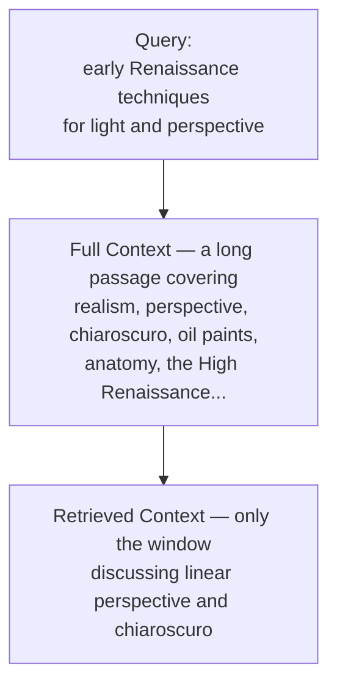
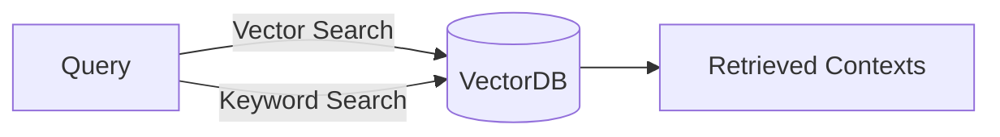
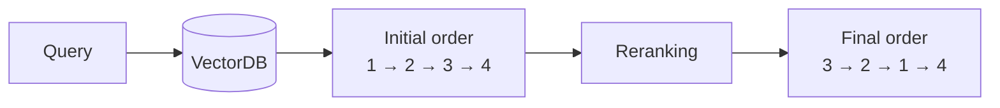

# Retrieval Optimization Techniques

🚀 A RAG system is only as good as the chunks it retrieves. Feed the generator the wrong context and even the best LLM will produce a confident, useless answer. Retrieval optimization is the craft of making sure the *right* information reaches the model — and the key insight is that you get three separate chances to intervene: **before** the search, **during** the search, and **after** the search.

## 🌟 The Three Stages of Optimization

Information retrieval is a critical process in systems designed to search and extract relevant information from vast datasets. Effective retrieval requires fine-tuned optimization at different stages to ensure results are accurate and meaningful.

| Stage | What you are tuning | The question it answers |
|---|---|---|
| **Pre-retrieval** | The *input* — how documents are chunked and how the query is phrased | "Am I even asking the right question, of the right-sized pieces?" |
| **Retrieval** | The *search itself* — how matching is performed | "Am I balancing precision against recall?" |
| **Post-retrieval** | The *output* — the ordering of what came back | "Of what I found, what deserves to go first?" |

The stages are cumulative, not alternatives. A weak chunking strategy cannot be rescued by a good reranker, because the reranker can only reorder what retrieval already handed it.

---

## 🔍 Stage 1: Pre-retrieval Optimization

Pre-retrieval optimization focuses on refining the input to maximize the efficiency and accuracy of the retrieval process.

### 1. Sentence Window

**In plain words:** don't store a whole document as one searchable item. Cut it into small pieces of a few sentences each, and search the *pieces*.

#### 📚 The textbook analogy

Someone asks you, "what causes rust?"

- **Without windowing**, you hand them a 400-page chemistry textbook and say *"it's in there."* Technically true. Completely useless.
- **With windowing**, you hand them the one paragraph about iron reacting with oxygen and water.

Same book, same knowledge. The difference is the *size of the thing you hand over*. A RAG system has exactly this choice to make about every document you give it.

#### Why big chunks fail — the averaging problem

When a document is stored for searching, it gets converted into a single list of numbers (a vector) that represents "what this text is about."

Now think about what that means for a long article covering twelve different topics. The system has to squeeze all twelve into *one* summary of meaning. The result is a blurry average — a vector that is slightly about realism, slightly about perspective, slightly about oil paints, and not strongly about any of them.

So when you ask a sharp question, that article is a weak match for everything and a strong match for nothing. **Small windows fix this because each window only has one thing to be about.**

#### A worked example

Take this short passage:

> The early Renaissance was a transformative period in art history, characterized by a revival of classical techniques and a focus on realism. Artists began using linear perspective to create depth. Chiaroscuro, the use of light and shadow, also gained prominence. Innovations like oil paints enhanced fine details.

**Stored as one chunk**, its single vector means roughly *"general overview of the Renaissance."* Ask "how did artists show light and shadow?" and it matches — but only weakly, because three-quarters of the chunk is about something else.

**Split into sentence windows**, you instead get four separately searchable pieces:

| Window | What it is about |
|---|---|
| 1. "The early Renaissance was a transformative period… focus on realism." | Period overview |
| 2. "Artists began using linear perspective to create depth." | **Perspective** |
| 3. "Chiaroscuro, the use of light and shadow, also gained prominence." | **Light and shadow** |
| 4. "Innovations like oil paints enhanced fine details." | **Materials** |

Now the same question lands on Window 3 — a near-perfect match, because that window is about nothing else.

#### What the "sliding" part means

The windows deliberately **overlap**, which is where the word *sliding* comes from. Rather than cutting cleanly at sentences 1-2, then 3-4, a sliding window takes sentences 1-2, then 2-3, then 3-4 — each new window re-includes the tail of the previous one.

Why bother? Because sentences lean on their neighbours. Imagine a window that contains only:

> "It was invented in Florence."

Useless on its own — *what* was invented? Overlap keeps the previous sentence attached, so the pronoun still has something to point at. **Overlap is insurance against cutting a thought in half.**

#### The trade-off to remember

Smaller is not automatically better. Cut too small and you shred the context — a single sentence may match your query while lacking the surrounding detail needed to actually answer it. Cut too large and you are back to the blurry average. The goal is *one idea per window*, not *the smallest possible window*.

---

**The formal version**, as your course notes put it: a sentence window approach segments larger documents into manageable windows or chunks, typically one or more sentences long. By creating a sliding window of sentences, search engines can:

- Enhance focus on smaller, contextually rich segments.
- Improve recall rates by preventing over-reliance on large, broad documents.
- Enable more precise matching for nuanced queries.

**Example:** When searching for "early Renaissance techniques for light and perspective," breaking long academic articles into sentence windows allows for better pinpointing of the sections discussing specific techniques, instead of returning the whole article and hoping the model finds the relevant paragraph.

### 2. Query Expansion

Query expansion enriches the initial user query by adding synonyms, related terms, or broader concepts. This helps in:

- Broadening the scope to capture relevant information that may use different terminology.
- Addressing the issue of **vocabulary mismatch** between user queries and indexed content.

**Technique:** Synonym-based and knowledge graph-based expansions can be applied to extend user input.

**Example:** A search for "laptop" might expand to include "notebook," "portable computer," and other related terms — so a document that never once uses the word *laptop* can still be found.

### 3. Query Rewriting

Query rewriting refines the original query to make it more search-friendly. This can involve:

- Reordering words for clarity.
- Correcting typos or ambiguous phrasing.
- Adjusting terms based on user intent.

**Example:** The query "weather Tokyo tomorrow" could be rewritten to "Tokyo weather forecast for tomorrow" for better retrieval results.

> 💡 **Expansion vs. Rewriting:** expansion *adds* terms to widen the net (helping recall); rewriting *restates* the query to sharpen it (helping precision). They pull in opposite directions, which is exactly why both exist.

---

## ⚙️ Stage 2: Retrieval Optimization

During the retrieval phase, it's crucial to employ techniques that balance precision and recall, ensuring results are relevant and comprehensive.

### 1. Hybrid Search

Hybrid search combines two main types of retrieval methods — **semantic** and traditional **keyword-based (syntax)** searches — to deliver:

- Broader coverage by integrating lexical matching with semantic understanding.
- Enhanced relevance through deeper contextual analysis.

**How it works:** The system might first use a **BM25** or **TF-IDF** approach for surface-level matching, and then apply semantic vector embeddings for deeper meaning-based refinement.

**Example:** Searching for "ways to improve sleep quality" can return results that match exact phrases as well as contextually related content like "better rest habits."

**Why combine them:** pure keyword search fails when the document uses different words for the same idea; pure vector search fails on exact identifiers — product codes, error numbers, surnames — where the literal string is the whole point. Each method covers the other's blind spot.

---

## 🎯 Stage 3: Post-retrieval Optimization

### 1. Reranking

Reranking involves applying additional algorithms to reorder the initial set of retrieved documents:

- **Approach:** Use machine learning models or heuristic rules to prioritize documents based on metrics like click-through rates, content freshness, or user engagement.
- **Outcome:** Boosts the prominence of higher-quality and more relevant documents.

**Example:** After retrieving documents about a given query, a reranking system will re-rank the retrieved contexts according to the query with an algorithm designed for re-ranking.

**Why a second pass helps:** the first-stage search is optimized to be *fast* across millions of chunks, so it uses a cheap similarity measure. A reranker is far more expensive per document but only ever sees the top handful — so you can afford a model that actually reads the query and the chunk together.

---

## Conclusion

Optimizing information retrieval involves a multi-layered approach that starts with refining the input (pre-retrieval), strategically managing the retrieval phase, and fine-tuning the output (post-retrieval). By incorporating techniques like sentence windowing, hybrid search, and reranking, retrieval systems can significantly enhance user satisfaction and information accuracy.

The practical takeaway: when a RAG system gives a bad answer, diagnose *which* stage failed before reaching for a fix. If the right chunk was never retrieved, no amount of reranking will help — the problem is upstream, in chunking or the query itself.

---

## Q&A

Every question asked while working through this file gets logged here, numbered sequentially as `### Q1:`, `### Q2:` … Each answer follows the same shape:

- The heading is the question **as asked** — often phrased as a statement to confirm.
- A one-sentence **bolded verdict** opens the answer, using ✅ / ❌ for confirm-or-correct questions.
- A concrete **analogy** (sub-heading with an emoji) carries the explanation, plus a comparison table when two concepts are being contrasted.
- Earlier answers are referred back to ("from Q1") so the picture stays connected.
- A bolded **One line:** summary closes the answer, restating the whole thing in a single sentence.

### Q1: In sentence windowing, are you sliding the input query, or the retrieved chunk?

**❌ Neither — you slide the window over your *documents*, at indexing time, long before any query exists.**

This is the single most common mix-up with sentence windowing, and it comes from the word "sliding" sounding like something that happens live, during a search. It doesn't.

#### 🗄️ The filing-cabinet analogy

Think of two completely separate moments in a RAG system's life:

1. **Filing day (indexing).** You take every document you own, cut each one into small overlapping pieces, and file them away. The window slides across the *text* here. This happens once, up front, with no user and no question anywhere in sight.
2. **Question day (retrieval).** Someone asks something. You search the already-filed pieces and pull out the closest matches. Nothing is being cut or slid at this point — the pieces were shaped long ago.

Sentence windowing lives entirely in step 1.

| | Slid over documents | Slid over the query | Slid over retrieved chunks |
|---|---|---|---|
| Is this sentence windowing? | ✅ Yes | ❌ No | ❌ No |
| When it happens | Indexing, once | — | — |

The query does get modified in this pipeline — but by **query expansion** and **query rewriting**, which are separate pre-retrieval techniques covered above. And retrieved chunks do get reworked afterwards — but by **reranking**, in post-retrieval. Three different stages, three different targets. Sentence windowing touches only the documents.

**One line:** The window slides across your documents while you are indexing them, not across the question and not across the results — chunking is a preparation step that finishes before the first query is ever asked.

---

### Q2: So this is the sliding window chunking methodology — a type of chunking strategy, correct?

**✅ Correct — sentence windowing is a chunking strategy, and it belongs to the sliding-window (overlapping) family.**

This follows directly from Q1: because the window is applied to documents at indexing time, it *is* by definition a chunking decision — chunking is simply the act of deciding how to cut documents up before storing them.

#### Where it sits among the chunking strategies

| Strategy | How it cuts | Weakness |
|---|---|---|
| **Fixed-size** | Every N characters or tokens | Slices mid-sentence, mid-word |
| **Sliding window** | N sentences, with overlap between neighbours | Some content stored twice |
| **Recursive** | Follows structure — paragraphs, then sentences | Needs clean formatting to work |
| **Semantic** | Cuts where the meaning shifts | Slowest; needs a model to decide |

Sliding window is the step up from fixed-size: same simplicity, but the overlap stops a thought from being cut in half.

#### ⚠️ One nuance worth knowing for interviews

Two related things share this name:

| | Sliding-window chunking | Sentence-window **retrieval** |
|---|---|---|
| What gets stored | Overlapping chunks of several sentences | Each **single sentence**, embedded on its own |
| What gets returned | That same chunk | The matched sentence **plus its neighbours** |
| The point | Don't cut a thought in half | Match precisely, but still hand the LLM full context |

The second is the sharper idea, and it's what LlamaIndex means by the term specifically. It **decouples what you match on from what you return** — so you get the pinpoint accuracy of a tiny chunk *and* the surrounding context of a large one. That sidesteps the size trade-off described above rather than merely balancing it. The course PDF describes the general first form.

**One line:** Yes — sentence windowing is sliding-window chunking, an overlap-based chunking strategy applied at indexing time; just be ready to distinguish it from "sentence-window retrieval," which embeds one sentence but returns several.
