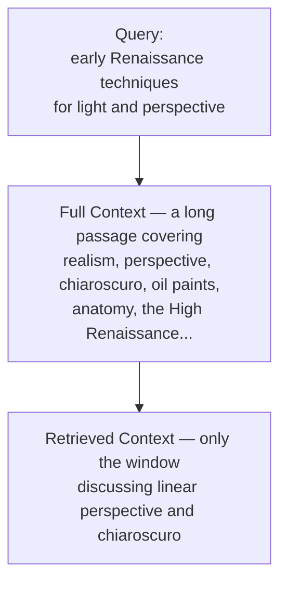
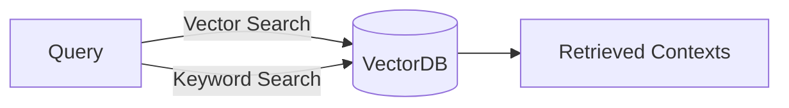
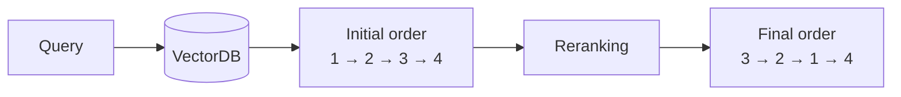

# Retrieval Optimization Techniques

🚀 A RAG system is only as good as the chunks it retrieves. Feed the generator the wrong context and even the best LLM will produce a confident, useless answer. Retrieval optimization is the craft of making sure the *right* information reaches the model — and the key insight is that you get three separate chances to intervene: **before** the search, **during** the search, and **after** the search.

## 🌟 The Three Stages of Optimization

Information retrieval is a critical process in systems designed to search and extract relevant information from vast datasets. Effective retrieval requires fine-tuned optimization at different stages to ensure results are accurate and meaningful.

| Stage | What you are tuning | The question it answers |
|---|---|---|
| **Pre-retrieval** | The *input* — how documents are chunked and how the query is phrased | "Am I even asking the right question, of the right-sized pieces?" |
| **Retrieval** | The *search itself* — how matching is performed | "Am I balancing precision against recall?" |
| **Post-retrieval** | The *output* — the ordering of what came back | "Of what I found, what deserves to go first?" |

The stages are cumulative, not alternatives. A weak chunking strategy cannot be rescued by a good reranker, because the reranker can only reorder what retrieval already handed it.

---

## 🔍 Stage 1: Pre-retrieval Optimization

Pre-retrieval optimization focuses on refining the input to maximize the efficiency and accuracy of the retrieval process.

### 1. Sentence Window

A sentence window approach segments larger documents into manageable windows or chunks, typically one or more sentences long. By creating a sliding window of sentences, search engines can:

- Enhance focus on smaller, contextually rich segments.
- Improve recall rates by preventing over-reliance on large, broad documents.
- Enable more precise matching for nuanced queries.

**Why it matters:** embedding an entire article averages its meaning into a single vector, so a document about twelve topics matches every one of them weakly. Narrow windows keep each vector about *one* thing.

**Example:** When searching for "early Renaissance techniques for light and perspective," breaking long academic articles into sentence windows allows for better pinpointing of the sections discussing specific techniques, instead of returning the whole article and hoping the model finds the relevant paragraph.

### 2. Query Expansion

Query expansion enriches the initial user query by adding synonyms, related terms, or broader concepts. This helps in:

- Broadening the scope to capture relevant information that may use different terminology.
- Addressing the issue of **vocabulary mismatch** between user queries and indexed content.

**Technique:** Synonym-based and knowledge graph-based expansions can be applied to extend user input.

**Example:** A search for "laptop" might expand to include "notebook," "portable computer," and other related terms — so a document that never once uses the word *laptop* can still be found.

### 3. Query Rewriting

Query rewriting refines the original query to make it more search-friendly. This can involve:

- Reordering words for clarity.
- Correcting typos or ambiguous phrasing.
- Adjusting terms based on user intent.

**Example:** The query "weather Tokyo tomorrow" could be rewritten to "Tokyo weather forecast for tomorrow" for better retrieval results.

> 💡 **Expansion vs. Rewriting:** expansion *adds* terms to widen the net (helping recall); rewriting *restates* the query to sharpen it (helping precision). They pull in opposite directions, which is exactly why both exist.

---

## ⚙️ Stage 2: Retrieval Optimization

During the retrieval phase, it's crucial to employ techniques that balance precision and recall, ensuring results are relevant and comprehensive.

### 1. Hybrid Search

Hybrid search combines two main types of retrieval methods — **semantic** and traditional **keyword-based (syntax)** searches — to deliver:

- Broader coverage by integrating lexical matching with semantic understanding.
- Enhanced relevance through deeper contextual analysis.

**How it works:** The system might first use a **BM25** or **TF-IDF** approach for surface-level matching, and then apply semantic vector embeddings for deeper meaning-based refinement.

**Example:** Searching for "ways to improve sleep quality" can return results that match exact phrases as well as contextually related content like "better rest habits."

**Why combine them:** pure keyword search fails when the document uses different words for the same idea; pure vector search fails on exact identifiers — product codes, error numbers, surnames — where the literal string is the whole point. Each method covers the other's blind spot.

---

## 🎯 Stage 3: Post-retrieval Optimization

### 1. Reranking

Reranking involves applying additional algorithms to reorder the initial set of retrieved documents:

- **Approach:** Use machine learning models or heuristic rules to prioritize documents based on metrics like click-through rates, content freshness, or user engagement.
- **Outcome:** Boosts the prominence of higher-quality and more relevant documents.

**Example:** After retrieving documents about a given query, a reranking system will re-rank the retrieved contexts according to the query with an algorithm designed for re-ranking.

**Why a second pass helps:** the first-stage search is optimized to be *fast* across millions of chunks, so it uses a cheap similarity measure. A reranker is far more expensive per document but only ever sees the top handful — so you can afford a model that actually reads the query and the chunk together.

---

## Conclusion

Optimizing information retrieval involves a multi-layered approach that starts with refining the input (pre-retrieval), strategically managing the retrieval phase, and fine-tuning the output (post-retrieval). By incorporating techniques like sentence windowing, hybrid search, and reranking, retrieval systems can significantly enhance user satisfaction and information accuracy.

The practical takeaway: when a RAG system gives a bad answer, diagnose *which* stage failed before reaching for a fix. If the right chunk was never retrieved, no amount of reranking will help — the problem is upstream, in chunking or the query itself.

---

## Q&A

Every question asked while working through this file gets logged here, numbered sequentially as `### Q1:`, `### Q2:` … Each answer follows the same shape:

- The heading is the question **as asked** — often phrased as a statement to confirm.
- A one-sentence **bolded verdict** opens the answer, using ✅ / ❌ for confirm-or-correct questions.
- A concrete **analogy** (sub-heading with an emoji) carries the explanation, plus a comparison table when two concepts are being contrasted.
- Earlier answers are referred back to ("from Q1") so the picture stays connected.
- A bolded **One line:** summary closes the answer, restating the whole thing in a single sentence.

*(No questions logged yet — the first one asked will be added below as `### Q1:`.)*
